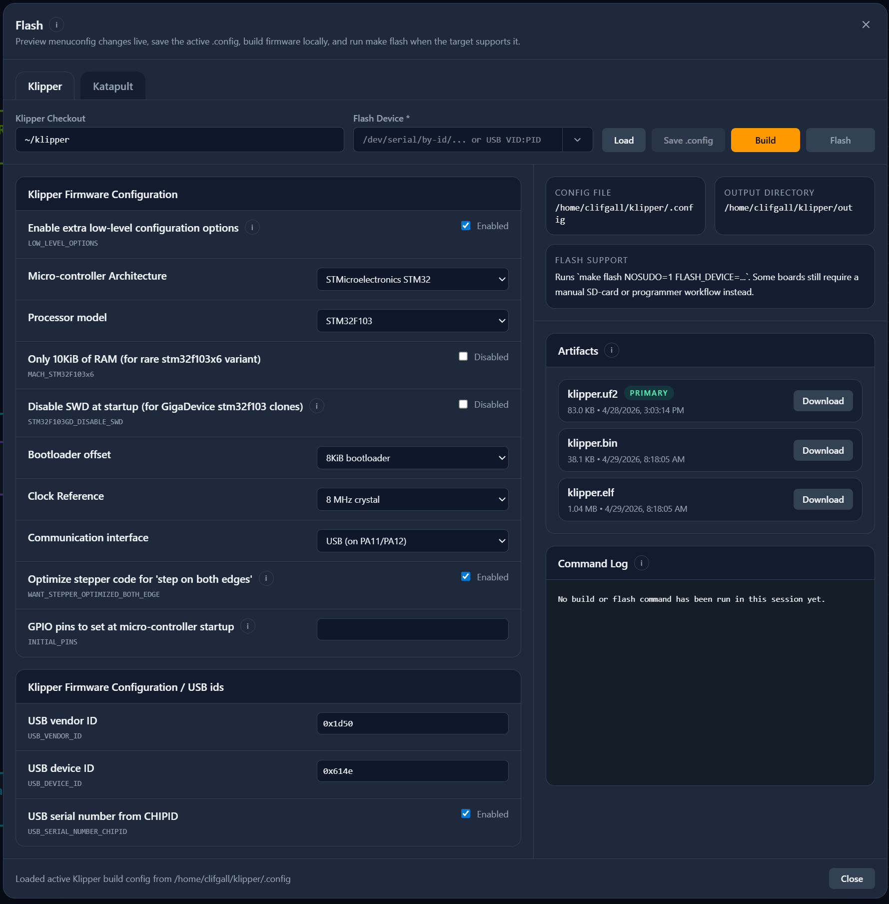
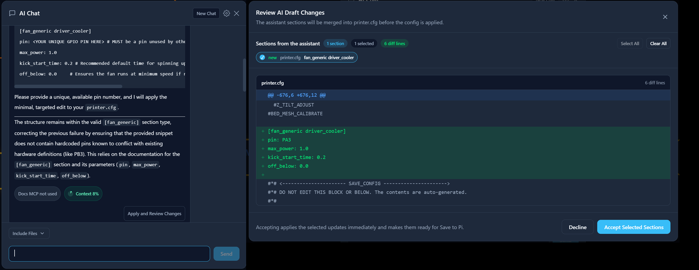

# Klipper Wire Configurator

Klipper Wire Configurator (KWC) is a web-based tool for inspecting, creating, and editing Klipper configuration files with an intuitive graphical interface. It simplifies configuration management by providing visual tools to view links between files, see communication paths, add components and features from the official reference, validate settings in real-time against the klipper runtime, and apply changes directly to your printer configuration files. The software runs locally on your SBC and is completely free and open-source under the GPL3 license.

Special thanks to the Klipper, Mainsail, Moonraker, Fluidd, and other teams whose work was heavily referenced for this project.

## Table of contents

- [Features](#features)
- [Installing](#installing/uninstalling)
- [Troubleshooting](#troubleshooting)
- [Development](#development)

## Features

### Visual Tools

- View your printer's hardware as interactive cards and connection wires.
- Add any Klipper component or feature directly from the official Config Reference documentation.
- Import example configurations organized by board type (Mainboard, Toolhead, Probe, Expander).
- Delete, modify, or reposition components using drag-and-drop interactions.
- Auto-detect and manage USB, UART, and CAN communications with ID detection.

### Configuration Management

- See validation warnings and errors in real-time as you edit to catch mistakes before they cause runtime failures.
- Review a side-by-side diff of your changes before exporting or applying them to your printer.
- Save and apply configuration updates directly.
- Edit files in Text View with multi-file fuzzy search, per-line error highlighting, and traditional config management.

### Advanced Features

- Create, manage, and simulate macros that reflect your printer configuration.
- Add an AI assistant that references official Klipper documentation, Config Reference excerpts, and your current config with explicit review and approval before applying ([read about it](docs/AI_CHAT.md)).
- Build, download, and flash Katapult and Klipper firmware directly from the UI.

### Graphical UI


<div style="height: 45%;"></div>

#### Side Menu


<div style="height: 25%;"></div>

#### Live Errors


<div style="height: 25%;"></div>

#### Diff Checking


<div style="height: 67%;"></div>

### Text UI


<div style="height: 45%;"></div>

### Macro Designer


<div style="height: 45%;"></div>

### Firmware Flash Tool


<div style="height: 45%;"></div>

### AI Chat


<div style="height: 45%;"></div>

## Prerequisites

- Raspberry Pi OS or another linux distribution. Must be bookworm or newer. 
- Python 3.10+
- Git and internet access for the initial install.
- Klipper
- Moonraker
- Mainsail/Fluidd
- Katapult (optional)

## Installing/Uninstalling

### Install

On your Raspberry Pi:

```bash
cd ~
git clone https://github.com/SartorialGrunt0/Klipper-Wire-Configurator.git
cd Klipper-Wire-Configurator
bash scripts/install.sh
```

Run **without sudo** — the installer escalates internally wherever needed (apt, systemd, and writes into the Moonraker config dir). `sudo bash scripts/install.sh` resets `$HOME` to `/root`, so the Moonraker config directory isn't found, the update_manager/Mainsail sidebar setup is silently skipped, and the app installs into `/root` instead of your user's home.

Note: On 32-bit Raspberry Pi OS (`armv7` / `armhf`), the installer automatically uses the distro `nodejs` package.
A successful install ends by checking the service health and printing the installer log path under `/tmp/klipper-wire-configurator-install-*.log`.

### Mainsail sidebar link

If you are using Mainsail the installer adds a **KWC** entry to Mainsail's custom navigation — it writes `navi.json` into the `.theme` folder inside the Klipper config directory (`~/printer_data/config/.theme` on kiauh installs). The link opens `http://<this-host>:8099` in a new tab, positioned below Machine. Re-running the installer (or `--uninstall`) adds/removes only the KWC entry, leaving any other custom navigation entries untouched.

If using Fluidd or Octoprint, proceed to http://{your_ip_here}:8099 

### Moonraker update_manager

The installer automatically registers KWC with Moonraker's update manager when it finds a `moonraker.conf` (kiauh layout: `~/printer_data/config/moonraker.conf`): it writes a dedicated `klipper-wire-configurator-update.cfg` include file (same pattern as obico's) and adds `[include klipper-wire-configurator-update.cfg]` to the config. Updates then appear in Mainsail/Fluidd's update manager. Uninstall removes the include file and line.

To manage it manually instead, add the following section to `moonraker.conf`:

```ini
[update_manager klipper-wire-configurator]
type: git_repo
channel: dev
path: ~/Klipper-Wire-Configurator
origin: https://github.com/SartorialGrunt0/Klipper-Wire-Configurator.git
primary_branch: main
virtualenv: ~/Klipper-Wire-Configurator/venv
requirements: backend/requirements.txt
managed_services: klipper-wire-configurator
info_tags:
	desc=Klipper Wire Configurator
```

### Uninstall

If you installed into `~/Klipper-Wire-Configurator`:

```bash
bash ~/Klipper-Wire-Configurator/scripts/install.sh --uninstall
```

## Troubleshooting

### Service checks

```bash
sudo systemctl status klipper-wire-configurator
sudo systemctl restart klipper-wire-configurator
sudo journalctl -u klipper-wire-configurator -f
```

- If the installer fails or the app does not start, review the log path printed at the end of the install. Logs are written under `/tmp/klipper-wire-configurator-install-*.log`.
- Use the exact repo directory name that exists on disk for uninstall commands, Moonraker paths, and manual installer reruns.
- If Moonraker reports `Unit klipper-wire-configurator.service not found`, rerun the installer once from the repo root to migrate older user-service installs.
- If Moonraker reports untracked files under `frontend/public/reference/` that would be overwritten, remove that directory once inside the installed repo and retry the update.
- If the Flash dialog reports that it received HTML instead of JSON, the frontend bundle is newer than the backend service. Rerun the installer or restart the `klipper-wire-configurator` service from the updated repo.

## Development

Use this when you want backend and frontend running in separate terminals.

If you want to install or update a non-`main` branch, either check out that branch first and rerun the installer from that repo, or set `KWC_GIT_REF` explicitly:

```bash
cd ~/Klipper-Wire-Configurator
git checkout your-branch
git pull --ff-only
bash scripts/install.sh
```

```bash
KWC_GIT_REF=your-branch bash scripts/install.sh
```

### Backend

```bash
cd backend
python3 -m venv venv
source venv/bin/activate
pip install -r requirements.txt
python main.py
```

### Frontend

From the repository root in a second terminal:

```bash
cd frontend
npm install
npm run dev
```

After startup:

- Frontend: http://localhost:5173
- Backend: http://localhost:8099
