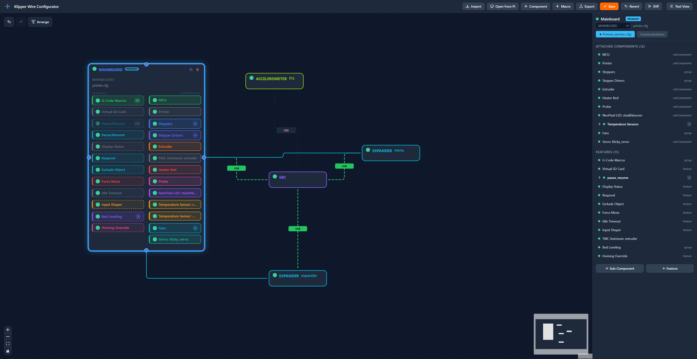
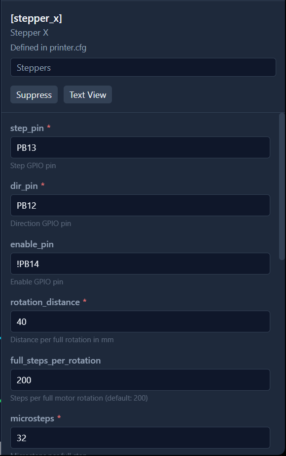
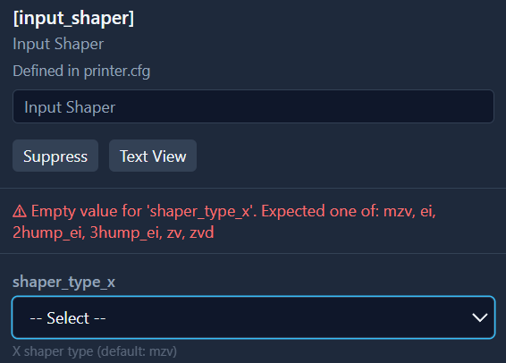
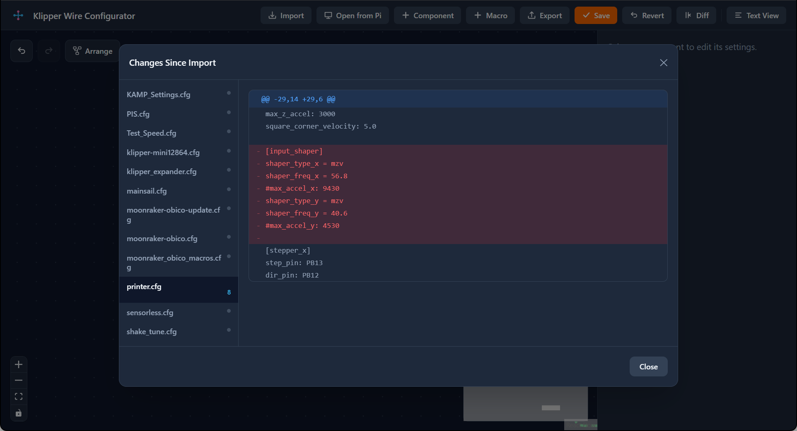
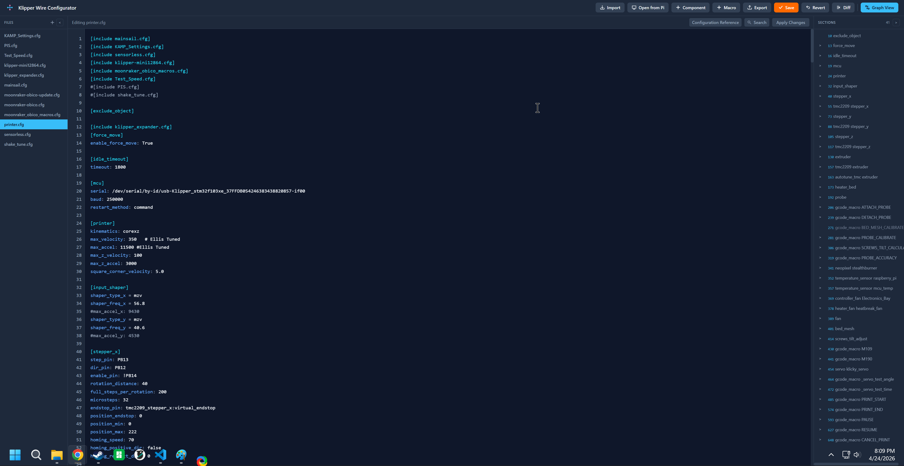
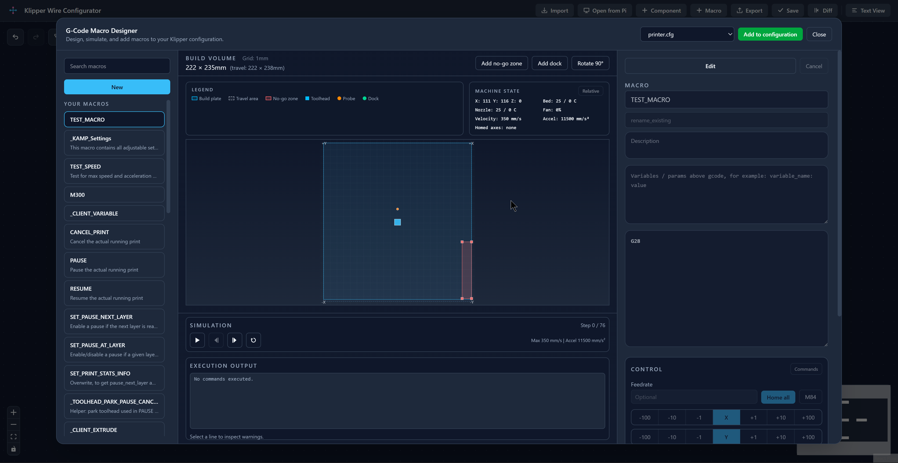

# Klipper Wire Configurator

## Introduction

Klipper Wire Configurator is a web app for inspecting, creating, and editing Klipper `printer.cfg` files in a graphical frontend. It aims to make creating and managing your klipper configuration easier.
It runs directly on your SBC. The software is entirely free to use and licensed under GPL3.

Credit to the klipper, mainsail, moonraker, fluidd, and other teams whom which I borrowed and referenced alot from.

## Table of contents

- [Features](#features)
- [Installing](#installing/uninstalling)
- [Troubleshooting](#troubleshooting)
- [Development](#development)

## Features

- Graphical front end with cards and wires to show connections
- Add components and features directly from the configuration reference.
- Add configurations directly from the klipper configuration examples and others.
- Delete, modify, or move components with simple UI elements and actions
- Live configuration checks with warnings and errors based on the klipper configuration reference.
- Diff configuration changes before exporting or applying changes.
- Apply changes directly to your configuration and firmware restart directly.
- Manage USB, UART, or CAN communcations with ID detection.
- Text View for traditonal configuration management, faster multi-file fuzzy search, and line referenced table of contents.
- Macro Designer with easy modifications and simulation.

### Graphical UI



#### Side Menu



#### Live Errors



#### Diff Checking



### Text UI



### Macro Designer



## Prerequisites

- Raspberry Pi OS or another Debian-based distro, bookworm or newer.
- Python 3.10+
- Git and internet access for the initial install
- A second device on the same network if you want to open the web UI remotely

The Raspberry Pi installer handles Node.js setup and installs the systemd service.

## Installing/Uninstalling

### Install

On your Raspberry Pi:

```bash
cd ~
git clone https://github.com/SartorialGrunt0/Klipper-Wire-Configurator.git
cd Klipper-Wire-Configurator
bash scripts/install.sh
```

If you want to install or update a non-`main` branch, either check out that branch first and rerun the installer from that repo, or set `KWC_GIT_REF` explicitly:

```bash
cd ~/Klipper-Wire-Configurator
git checkout your-branch
git pull --ff-only
bash scripts/install.sh
```

```bash
KWC_GIT_REF=your-branch bash scripts/install.sh
```

On 32-bit Raspberry Pi OS (`armv7` / `armhf`), the installer automatically uses the distro `nodejs` package. I havent tried 64-bit YMMV.

After install, proceed to http://{your_ip_here}:8099

A successful install ends by checking the service health and printing the installer log path under `/tmp/klipper-wire-configurator-install-*.log`.

### Moonraker update_manager

If you want Moonraker to manage updates in Mainsail or Fluidd, add the following section to `moonraker.conf`:

```ini
[update_manager klipper-wire-configurator]
type: git_repo
channel: dev
path: ~/Klipper-Wire-Configurator
origin: https://github.com/SartorialGrunt0/Klipper-Wire-Configurator.git
primary_branch: main
virtualenv: ~/Klipper-Wire-Configurator/venv
requirements: backend/requirements.txt
managed_services: klipper-wire-configurator
info_tags:
	desc=Klipper Wire Configurator
```

### Uninstall

If you installed into `~/Klipper-Wire-Configurator`:

```bash
bash ~/Klipper-Wire-Configurator/scripts/install.sh --uninstall
```

If your repo lives at `~/klipper-wire-configurator`, use that exact lower-case path instead.

## Troubleshooting

### Service checks

```bash
sudo systemctl status klipper-wire-configurator
sudo systemctl restart klipper-wire-configurator
sudo journalctl -u klipper-wire-configurator -f
```

- If the installer fails or the app does not start, review the log path printed at the end of the install. Logs are written under `/tmp/klipper-wire-configurator-install-*.log`.
- Use the exact repo directory name that exists on disk for uninstall commands, Moonraker paths, and manual installer reruns.
- If Moonraker reports `Unit klipper-wire-configurator.service not found`, rerun the installer once from the repo root to migrate older user-service installs.
- If Moonraker reports untracked files under `frontend/public/reference/` that would be overwritten, remove that directory once inside the installed repo and retry the update.
- If the firmware dialog reports that it received HTML instead of JSON, the frontend bundle is newer than the backend service. Rerun the installer or restart the `klipper-wire-configurator` service from the updated repo.

## Development

Use this when you want backend and frontend running in separate terminals.

### Backend

```bash
cd backend
python3 -m venv venv
source venv/bin/activate
pip install -r requirements.txt
python main.py
```

### Frontend

From the repository root in a second terminal:

```bash
cd frontend
npm install
npm run dev
```

After startup:

- Frontend: http://localhost:5173
- Backend: http://localhost:8099
