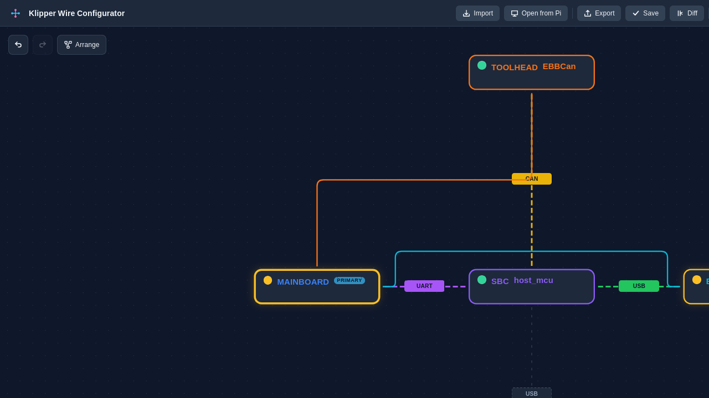
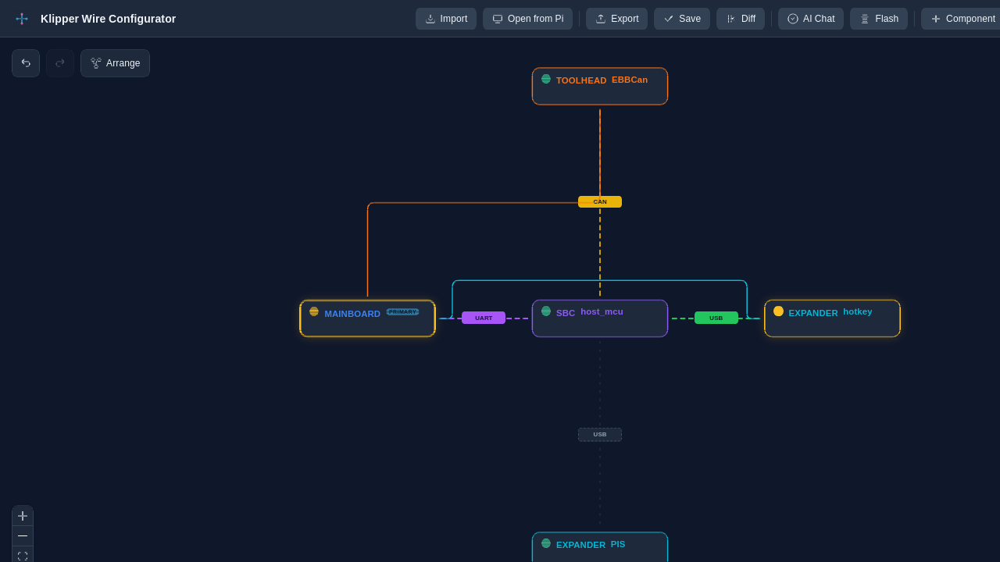
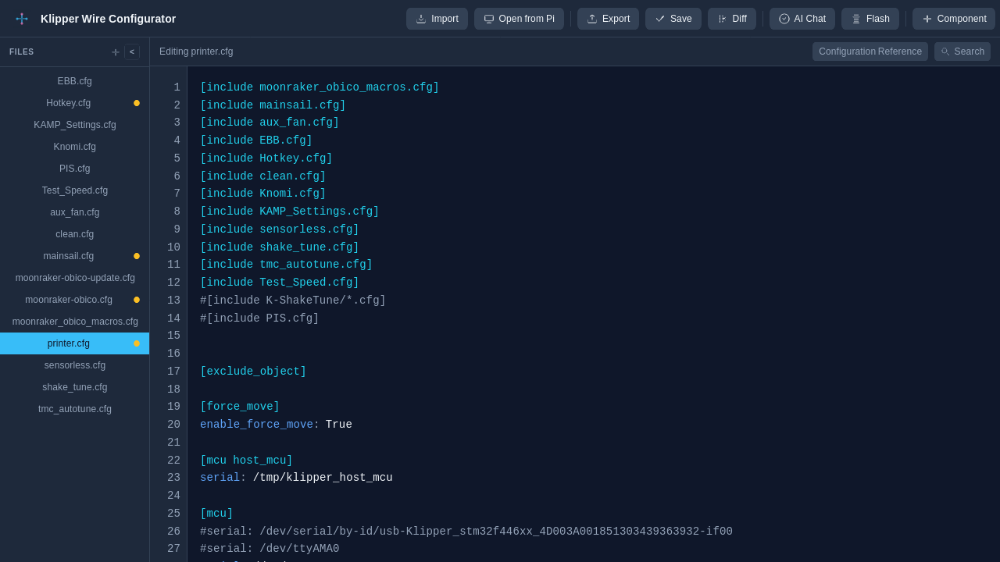

# Getting Started

Welcome to **Klipper Wire Configurator (KWC)** — your editor for Klipper printer configurations.

This guide walks you through the first startup, importing your first config, and understanding the workspace layout.

---

## What is KWC?

KWC is a visual editor for Klipper `printer.cfg` files that combines:

- **Graph View** — Visual hardware tree showing your printer's components and connections
- **Text View** — Direct config file editing with live validation
- **AI Assistant** — Context-aware help powered by Klipper documentation
- **Macro Designer** — Visual G-code macro editor with motion simulation
- **Flash Tool** — Build and flash Klipper/Katapult firmware (on supported hardware)

---

## First Startup

### Opening KWC

When you first load KWC:

**The toolbar contains all major actions:**

| Button | Purpose |
|--------|---------|
| **Import** | Load config files or a folder from your computer |
| **Open from Pi** | Open configs from your Pi's config directory |
| **Export** | Save your current config to your computer |
| **Save** | Write changes back to the Pi's config directory |
| **Revert** | Discard changes and reload the original |
| **Diff** | Compare your changes against the original |
| **AI Chat** | Get help from the AI assistant |
| **Flash** | Build and flash firmware |
| **Component (+)** | Add hardware/components to the graph |
| **Macro** | Open the Macro Designer |
| **Manual** | Open this user manual |
| **⚙ Customize top bar** | Show or hide toolbar items (remembers your choice) |

---

## Importing Your First Config

If you already have Klipper installed, KWC can load your configuration directly. If you are on a fresh build or your files did not immediately load, see the sections below.

### From Your Pi

When running KWC on your Raspberry Pi:

1. Click **Open from Pi** in the toolbar
2. Enter the config directory (default: `~/printer_data/config`) and click **Refresh**
3. Check the `.cfg` files to load (use **All**/**None** to select or clear quickly). Klipper's `SAVE_CONFIG` backup files are hidden from this list.
4. Optionally untick **Clear existing config** if you want to keep what's already loaded
5. Click **Open N Files** to load the project

### From Your Computer

1. Click **Import** in the toolbar
2. A dialog opens with a drag-and-drop zone and two buttons: **Select Files** and **Select Folder**
3. Choose your `.cfg` file(s) or folder from your computer
4. You will see a file selection list with checkboxes — you can deselect individual files
5. If any selected files already exist in the project, you will be asked to confirm overwriting them
6. Click **Import** to load

> **Note:** Import is a **read-only** operation. Your original file is not modified. Files are staged into the current project as unsaved changes — to persist them, use **Save** (writes to the Pi's config directory) or **Export** (download).

**Multi-file projects:**

- KWC attempts to identify the main config file (printer.cfg)
- Include relationships (`[include *.cfg]`) are resolved
- Cross-file validation checks for duplicates and missing dependencies

---

## Understanding the Workspace

After importing, you will see the **Graph View** by default.

### Graph View

The graph organizes your config into a hardware tree:

- **SBC Node** — Your Raspberry Pi (or other single-board computer)
- **Mainboard Node** — Your printer's primary main controller board
- **Accessory Nodes** — Additional MCUs such as toolhead boards, expander boards, probes, etc.
- **Config File Nodes** — Individual `.cfg` files in your project

**Common actions:**

- **Drag nodes** — Reparent components (e.g., move a stepper to a toolhead)
- **Click a node** — Open the Settings Panel with parameters
- **Node buttons** — Each node shows **Duplicate** and **Delete** buttons; deleting a hardware node asks for confirmation
- **Scroll to zoom** — Adjust the graph scale

### Switching to Text View

Click the **Text View** button in the toolbar to see the raw config file:

The text editor includes:

- **Live validation** — Errors highlight as you type
- **Section TOC** — Jump to any section header
- **Configuration Reference** — A dialog that searches bundled Klipper documentation
- **Search all files** — Find sections across multiple files

You can switch between Graph and Text views at any time. Both views sync automatically — changes in one update the other.

---

## Next Steps

Now that you have imported a config, try these:

1. **Explore the Graph** — Click nodes to see their parameters and how they connect
2. **Verify Validation** — Ensure no red badges appear on your mainboard or toolhead nodes
3. **Try the AI Chat** — Ask "How do I change my bed leveling offset?" to see the AI in action
4. **Deep Dive** — Click **Manual** in the toolbar to learn about specific components

---

## Keyboard Shortcuts

- **Undo / Redo** — `Ctrl+Z` / `Ctrl+Y` (Graph View)
