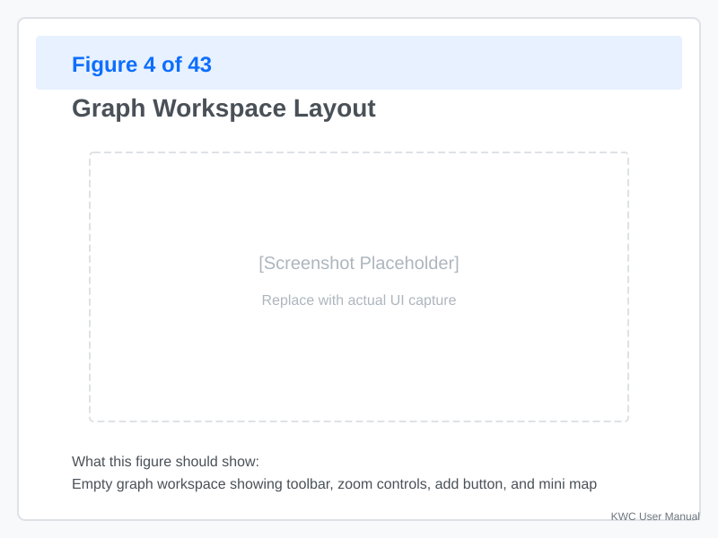
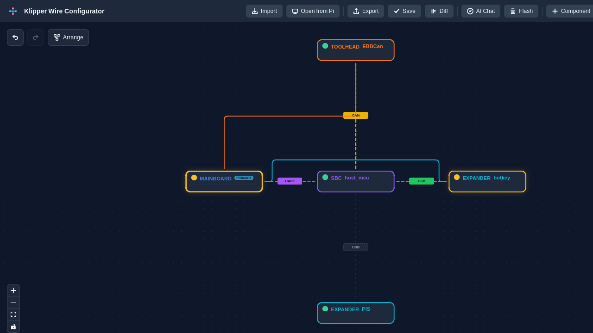
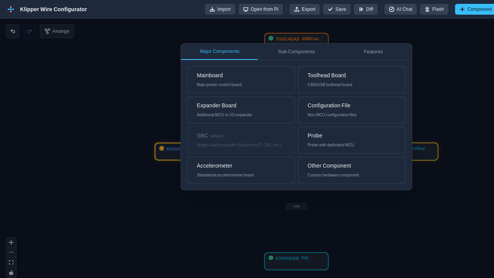
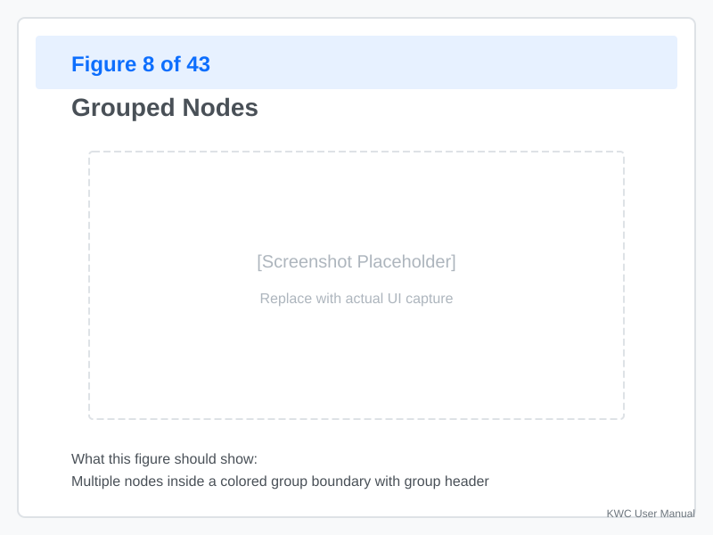
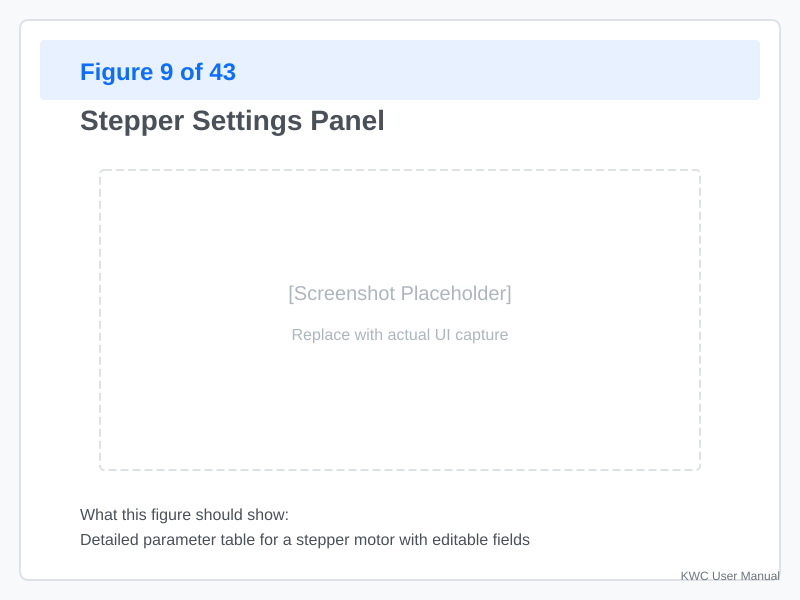

# Graph UI

The **Graph View** provides a visual representation of your Klipper configuration as an interactive hardware tree. This is the default view after importing a config.

---

## Understanding the Graph Structure

The graph organizes your printer's components into a hierarchical tree:

### Hardware Nodes

| Node Type | Purpose |
|-----------|---------|
| **SBC** | Your Raspberry Pi (single-board computer) — the brain running Klipper |
| **Mainboard** | The printer's main controller board (e.g., Fysetc Spider, MKS Robin) |
| **Toolhead** | The moving carriage containing extruders, heaters, and motors |
| **Expander** | Additional boards connected via UART or CAN bus |

### Child Components

Within each hardware node, you'll find:

- **Steppers** — X, Y, Z motors and extruder motors
- **Drivers** — TMC2209, TMC2208, etc. (attached to steppers)
- **Heaters** — Hotend heaters, heated bed, heatbreak
- **Fans** — Part cooling fan, hotend fan, controller fan
- **Sensors** — Thermistors, endstops, probes
- **Features** — LEDs, displays, servos, accelerometers

### Connection Types

The lines (edges) connecting nodes represent the communication and power paths between components:

- **USB Edge** — Represents a direct USB connection (e.g., SBC to mainboard).
- **UART Edge** — Represents serial communication between boards.
- **CAN Edge** — Represents CAN bus communication (common for toolhead modules).
- **Power Edge** — Represents power distribution. *Note: These are primarily conceptual and may not be explicitly rendered for all connections.*

---

## Working with the Graph

### Navigation

- **Pan** — Click and drag the background to move the view.
- **Zoom** — Use the scroll wheel or pinch gesture to zoom in/out.
- **Fit to Screen** — Double-click the background or press `F` to automatically center and scale all nodes.
- **Auto-Arrange** — Click the "Auto-Layout" button in the toolbar to automatically reorganize the graph for better readability.

### Selecting Nodes

**Click a node** to:
- See its parameters in the Settings Panel (opens on the right)
- View validation status (green/yellow/red badges)
- Access context menu via right-click

**Multi-select** by holding `Shift` while clicking multiple nodes.

### Adding Components

**Click the "+" button** in the toolbar or right-click a parent node to add a new component:

1. Choose a category (e.g., Steppers, Heaters).
2. Select the specific component from the list.
3. The component will be automatically attached to the selected parent node.

**Common additions:**

| Action | Steps |
|--------|-------|
| Add stepper motor | Right-click Toolhead → Steppers → X Stepper |
| Add temperature sensor | Right-click Mainboard → Sensors → Thermistor |
| Add probe | Right-click Toolhead → Sensors → Probe |
| Add accelerometer | Right-click Toolhead → Sensors → ADXL345 |

### Reparenting Components

To reorganize your hardware hierarchy, you can **drag and drop** components to change their parent:

1. Click and hold the component node.
2. Drag it over the target parent node (e.g., move a stepper from the Mainboard to the Toolhead).
3. Release the mouse button. The configuration is updated instantly.

**Validation:** KWC automatically verifies that the new parent is compatible with the component type.

### Grouping and Un grouping

**Create a group:**
1. Select multiple nodes (hold `Shift` and click)
2. Right-click → **Group Selected**
3. Nodes are wrapped in a container for easier organization

**Un group:**
1. Right-click the group
2. Select **Ungroup**

**Why group?**
- Logical organization (e.g., all Toolhead components together)
- Easier to move multiple components at once
- Cleaner graph for complex printers

---

## Editing Node Parameters

### Settings Panel

When you select a node, the **Settings Panel** appears with:

- **Section name** — The config section header (e.g., `[stepper_x]`)
- **Parameters** — Editable fields with validation
- **Validation errors** — Red highlights with explanations
- **Reference link** — Quick access to Klipper documentation

### Editing Parameters

**Steps:**
1. Click a field to edit (text box, dropdown, checkbox)
2. Enter the new value
3. Validation runs immediately
4. Changes are staged (not saved until you export/apply)

**Common parameter types:**

| Type | Examples | Description |
|------|----------|-------------|
| **Text** | `step_pin: PB0` | Standard text input for pins and labels. |
| **Number** | `rotation_distance: 40` | Numeric values for distances, speeds, etc. |
| **Boolean** | `endstop_pin: endstop_z` | True/False toggles. |
| **Dropdown** | `microsteps: 16` | Selection from a predefined list of valid options. |
| **Pin** | `step_pin: PB0` | Specialized pin input with real-time hardware validation. |

### Validation Feedback

**Real-time validation** catches errors as you type:

- **Red underline** — Invalid value (e.g., pin already in use)
- **Yellow underline** — Warning (e.g., non-recommended value)
- **Badge on node** — Summary of all errors/warnings for that node

**Example:**
- You set `step_pin: PB0` on stepper_x
- You try `step_pin: PB0` on stepper_y
- KWC shows: "Pin PB0 already used by [stepper_x]"

---

## Keyboard Shortcuts

| Shortcut | Action |
|----------|--------|
| `F` | Fit all nodes to screen |
| `Delete` | Remove selected node |
| `Ctrl+D` | Duplicate selected node |
| `Ctrl+Z` | Undo last change |
| `Ctrl+Y` | Redo last change |

---

## Common Workflows

### Building a Printer from Scratch

1. **Start with SBC** — Automatically added on project creation
2. **Add Mainboard** — Click "+" → Hardware → Mainboard
3. **Connect to SBC** — Drag mainboard node under SBC (creates USB edge)
4. **Add Toolhead** — Right-click Mainboard → Add Toolhead
5. **Add components** — Steppers, heaters, sensors under Toolhead
6. **Set parameters** — Click each node and configure values
7. **Validate** — Ensure no red badges appear

### Modifying an Existing Config

1. **Import the config** — File → Import
2. **Review graph** — Identify components that need changes
3. **Add missing hardware** — Use Add menu
4. **Edit parameters** — Click nodes and modify in Settings Panel
5. **Reparent if needed** — Drag nodes to new parent
6. **Validate** — Check for errors before exporting

### Troubleshooting Validation Errors

1. **Click the red badge** on a node to see the specific error message.
2. **Check the Settings Panel** to identify which parameter is failing.
3. **Read the reference link** provided in the panel for official Klipper documentation.
4. **Use the AI Chat** for specific questions (e.g., "Why is my stepper_x not validating?").
5. **Fix and verify** — Update the value and ensure the badge turns green.

---

## Appendix: Node Types Reference

### SBC Nodes

- Raspberry Pi 3B/3B+/4/5
- Odroid
- Other Linux SBCs

### Mainboard Types

- Fysetc Spider (Fysetc)
- MKS Robin (MKS)
| BigTreeTech SKR (BTT)
- Duet (Duet)
- Custom/Other

### Toolhead Configurations

- Single extruder (standard)
- Dual extruder (tandem or independent)
- IDEX (independent dual extruder)
- CoreXY (Voron style)
- Cartesian (standard)

---
