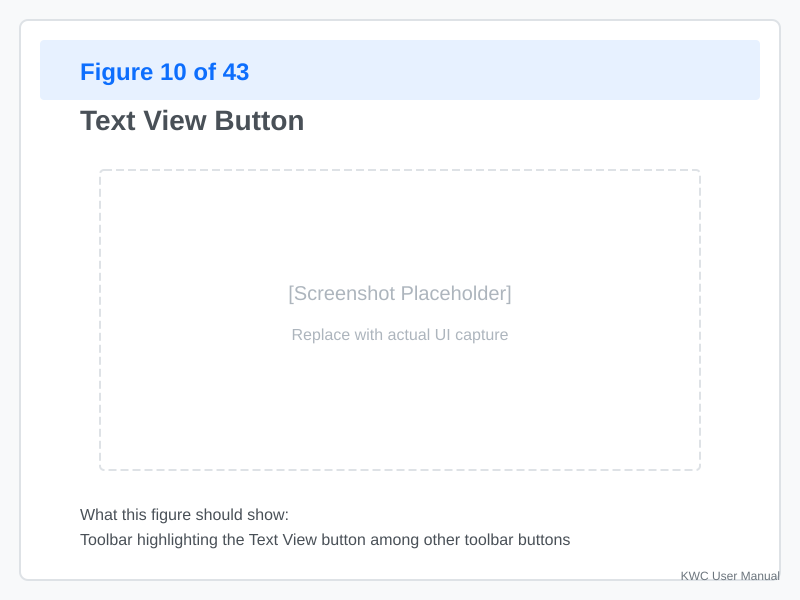
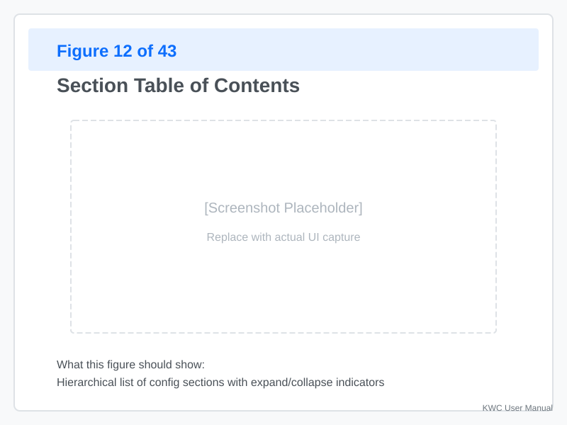
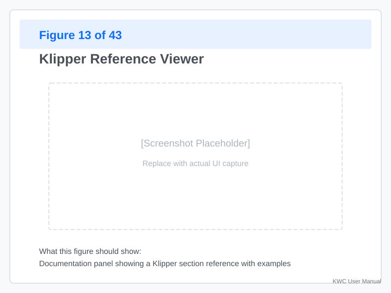
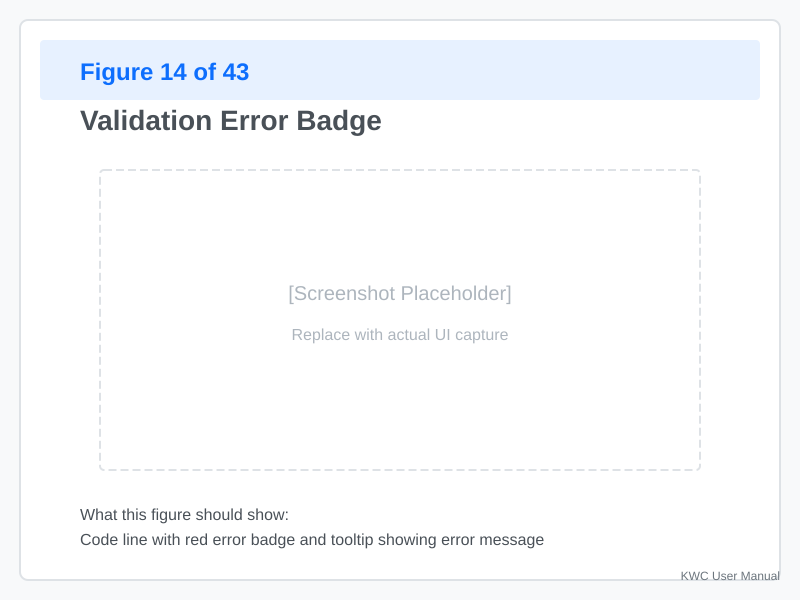
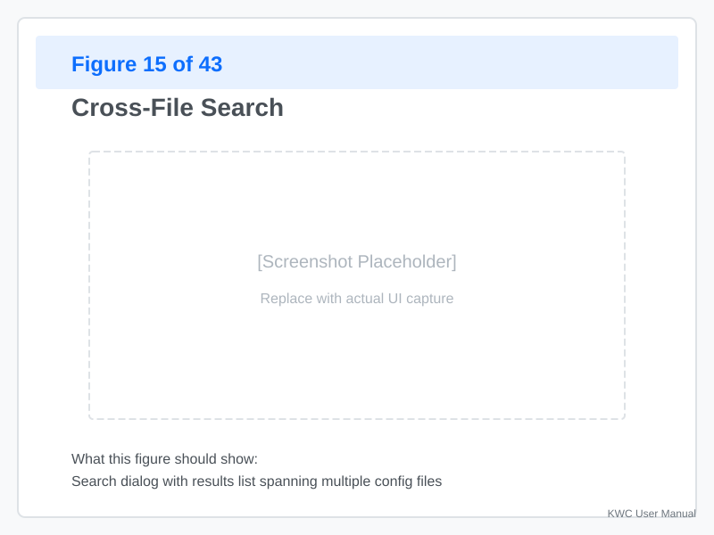
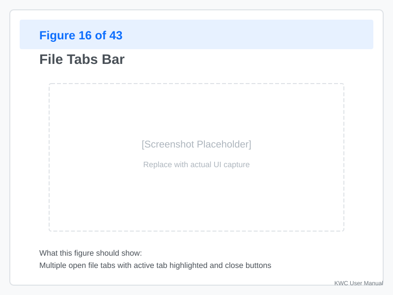

# Text UI

The **Text View** gives you direct access to the raw Klipper configuration files. Use this when you prefer editing plain text, need fine-grained control, or want to see the exact output.

---

## Opening Text View



**Click the "Text View"** button in the toolbar (next to "Graph View").

**Keyboard shortcut:** `Ctrl+T` (planned, not yet implemented).

When activated:
- The graph disappears
- A text editor opens with your config file
- The toolbar remains accessible

---

## Editor Layout


The editor consists of three main areas:

### Main Editor Pane (Center)

- **Live text editing** — Type directly into the editor
- **Syntax highlighting** — Sections, parameters, and values are color-coded
- **Line numbers** — Shown on the left
- **Validation markers** — Errors and warnings underlined

### Table of Contents (Left Sidebar)



The TOC shows all sections in your config. It appears on the **left side** of the editor:

- **Click a section** — Jump to that section in the editor
- **Expandable** — Some sections show sub-parameters
- **Active section** — Highlighted with a background color
- **Validation status** — Sections with errors show a red dot

**Search the TOC:**
- Type in the search box at the top
- Filters sections in real-time

### Reference Viewer (Right Sidebar)



The Reference Viewer appears on the **right side** of the editor and shows Klipper documentation for the currently selected section:

- **Automatic** — Updates when you click a section
- **Manual** — Type a section name in the search box
- **Navigation** — Click links to browse related documentation

**To use:**
1. Click a section in the editor or TOC
2. Reference documentation appears on the right
3. Click any link to navigate within the docs

---

## Editing Config Text

### Basic Editing

**Add a section:**
```
[gcode_macro MY_MACRO]
gcode:
    M117 Hello!
```

**Add a parameter:**
```
[stepper_x]
step_pin: PB0
dir_pin: PB1
enable_pin: !PB2
rotation_distance: 40  # Add this line
```

**Edit a value:**
- Click the value
- Type the new value
- Validation runs immediately

### Keyboard Shortcuts

| Shortcut | Action |
|----------|--------|
| `Ctrl+F` | Cross-file search |
| `Ctrl+G` | Go to line |
| `Ctrl+/` | Toggle comment |
| `Ctrl+Space` | Parameter autocomplete (planned) |
| `Tab` | Indent (or autocomplete) |

### Validation Feedback



**Errors** appear as red underlines:
- **Hover** — See the error message
- **Click** — Jump to the related setting in the TOC

**Warnings** appear as yellow underlines:
- **Hover** — See the warning message
- **May still work** but not recommended

**Example:**
```
[temperature_sensor my_sensor]
microcontroller: wrong_value  # ← Red underline: "Invalid MCU name"
```

**Live validation** runs as you type, updating markers instantly.

### Cross-File Search



**When working with multi-file projects:**

1. **Click Search** (or `Ctrl+F`)
2. **Enter your search term** (section name, parameter, value)
3. **Results show** all files containing matches
4. **Click a result** — Jump to that line in that file

**Example searches:**
- `probe` — Find all probe-related sections
- `step_pin` — Find all pin assignments
- `G28` — Find all places where homing is called

---

## File Operations

### Adding a New File

**From the editor toolbar:**

1. **Click "Add File"** (+ icon)
2. **Choose:**
   - **Blank config** — Start with an empty file
   - **From example** — Use a bundled template

**Example usage:**
- Create `bed_sensors.cfg` for bed temperature sensors
- Create `macros.cfg` for custom G-code macros
- Create `tuning.cfg` for PID tuning values

### Renaming a File

1. **Right-click the file tab** (or filename in TOC)
2. **Select "Rename"**
3. **Enter new name** (e.g., `printer.cfg` → `main.cfg`)
4. **Include statements update** automatically

**Warning:** If other files within the project workspace reference this file via `[include]`, those statements are updated automatically to reflect the new path.

### Copying a File

1. **Right-click the file tab**
2. **Select "Copy"**
3. **Enter new filename**
4. **New file appears** as a tab with identical content

**Use case:**
- Backup a working configuration
- Create variations (e.g., `printer_left.cfg`, `printer_right.cfg`)

### Deleting a File

1. **Right-click the file tab**
2. **Select "Delete"**
3. **Confirm** (if file has sections in use)

**Safety:** KWC warns you if the file contains sections referenced by other files.

---

## Switching Between Files



**When your project has multiple files:**

- **Tabs** — Each open file appears as a tab at the top
- **Click a tab** — Switch to that file
- **Close a tab** — Click the `×` on the tab
- **Active file** — Highlighted with a different background

**Keyboard navigation:**
- `Ctrl+Tab` — Switch to next file
- `Ctrl+Shift+Tab` — Switch to previous file

---

## Working with the Reference Viewer

### Accessing Documentation

**Method 1: Automatic**
1. Click any section in the editor
2. Reference viewer shows that section's documentation

**Method 2: Manual search**
1. Type in the reference search box
2. Select from matching sections
3. Documentation loads

**Method 3: From TOC**
1. Click a section in the TOC
2. Both editor and reference viewer update

### Navigating Documentation

The reference viewer includes:
- **Clickable headings** — Jump to subsections
- **Cross-references** — Links to related sections
- **Examples** — Sample configurations
- **Parameter tables** — Lists all parameters with descriptions

**Tip:** Click "Open in new tab" to view documentation side-by-side with the editor.

---

## Best Practices

### When to Use Text View

✅ **Use Text View when:**
- You need precise control over formatting
- You're copying sections from documentation
- You want to see the exact output
- You're comfortable with Klipper syntax
- You need to edit many parameters quickly

❌ **Use Graph View when:**
- You're learning Klipper structure
- You want visual confirmation of connections
- You need to add hardware components
- You prefer form-based editing

### Workflow Integration

**Recommended approach:**

1. **Start with Graph View** — Add and organize components
2. **Switch to Text View** — Fine-tune parameters
3. **Validate** — Check for errors in both views
4. **Switch back and forth** — Use each view's strengths

**Example:**
- Graph View: Add a stepper motor and connect it
- Text View: Fine-tune `rotation_distance` and `microsteps`
- Graph View: Verify the stepper appears correctly in the toolhead

---

## Troubleshooting

### Text Doesn't Update After Graph Edit

**Problem:** You edited a node in Graph View but the text didn't change.

**Solution:**
1. **Refresh the editor** — Click outside the editor pane
2. **Check for errors** — Validation errors may block updates
3. **Rebuild** — Use File → Rebuild (if available)

### Editor Seemingly Frozen

**Problem:** The editor stops responding to input.

**Solution:**
1. **Check validation** — Large configs may take time to process
2. **Close other tabs** — Reduce memory usage
3. **Restart the app** — As a last resort

### Reference Viewer Not Loading

**Problem:** The reference viewer shows "Loading..." or is blank.

**Solution:**
1. **Check your connection** — Online reference needs internet
2. **Click a section** — Sometimes requires manual trigger
3. **Use offline reference** — Falls back to bundled documentation

---

## Appendix: Editor Configuration

### Supported Encodings

- UTF-8 (default)
- ASCII
- Latin-1 (legacy)

### Line Ending Handling

- LF (Unix/Linux) — Recommended
- CRLF (Windows) — Auto-detected and preserved
- CR (classic Mac) — Converted to LF

### Auto-Save

- **Not automatic** — KWC does not auto-save
- **Staged changes** — Edits are held in memory
- **Export/Apply** — Required to persist changes

---
