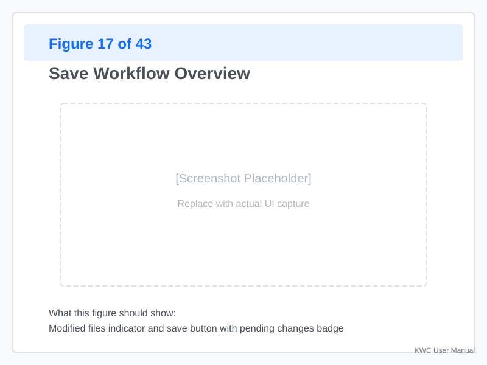
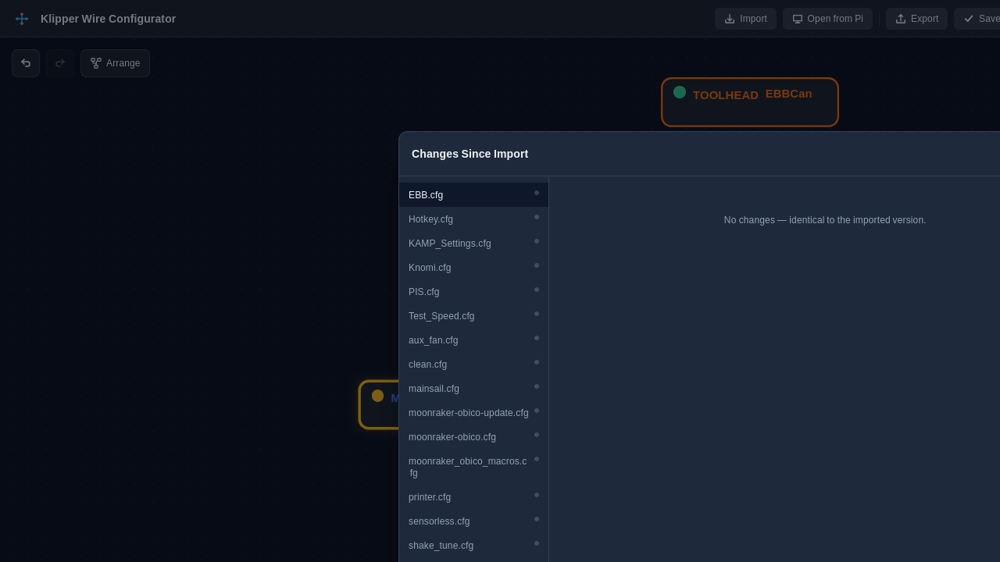
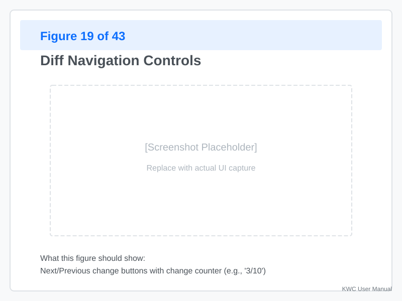
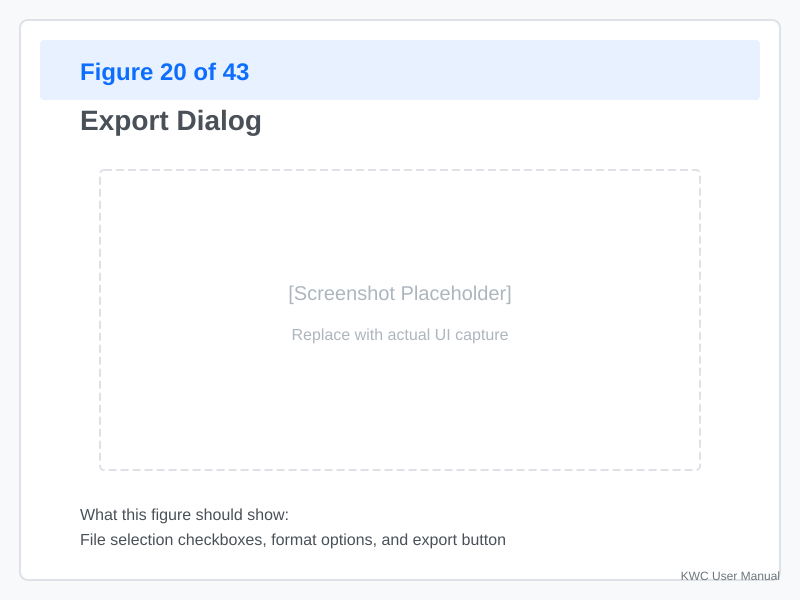
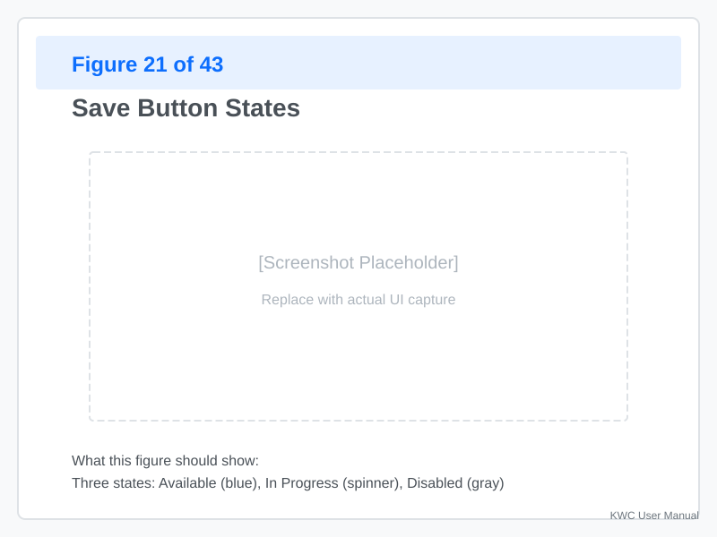
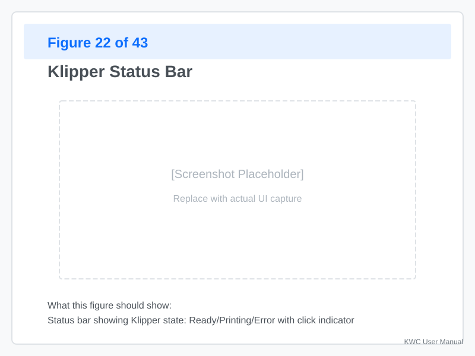
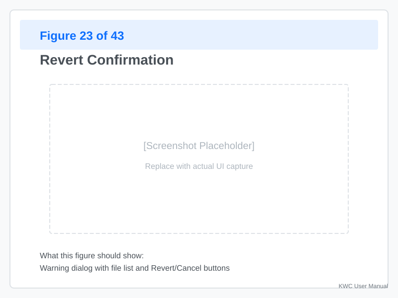

# Save, Diff, and Export

Once you've made changes to your configuration, you need to save, review, and export them. This section covers the complete workflow from editing to applying changes.

---

## Understanding the Workflow



The typical workflow is:

1. **Edit** — Make changes in Graph or Text View
2. **Diff** — Review changes before applying
3. **Export/Save** — Write changes to disk (native) or download (browser)

> **Safety Net:** Changes are **staged** in memory. They do not affect your actual configuration files or your printer until you click **Save** (Native) or **Export** (Browser). This allows you to experiment freely without risk.

---

## The Diff Viewer



**Click the "Diff"** button in the toolbar to open the diff viewer.

### What You'll See

The diff viewer shows two columns:

| Column | Content |
|--------|---------|
| **Original** | The config as it was when imported |
| **Current** | Your edited version with changes |

### Change Markers

**Green lines:** Added content
```diff
+rotation_distance: 40
```

**Red lines:** Removed content
```diff
-enable_pin: !PB2
```

**Gray lines:** Context (unchanged lines around changes)
```
[stepper_x]
step_pin: PB0
```

### Diff Navigation



**Use the navigation buttons:**
- **Previous change** — Jump to the previous edit
- **Next change** — Jump to the next edit
- **List all changes** — See a summary of all modifications

**Click any line** — Jump directly to that section in the editor.

**Pro-Tip:** Always review the Diff viewer before saving. It is the final confirmation of exactly what lines will be added or removed from your config files.

---

## Exporting Your Config

### Export to Computer (Browser Mode)

When using KWC in a web browser, you'll **Export** your config to download it.



**Steps:**
1. **Click "Export"** in the toolbar
2. **Choose format:**
   - **Single file** — All sections merged into one file
   - **Multi-file** — Preserve the original file structure (Best for complex setups with multiple config files, e.g., `printer.cfg`, `macros.cfg`, `custom_config.cfg`).
3. **Choose destination** — Your computer's Downloads folder
4. **Click "Export"** — The file(s) download

**Result:** A `.cfg` file (or folder of files) ready to transfer to your printer.

### What Gets Exported

- **All config files** in your project
- **Comments preserved** — Your annotations remain
- **Formatting preserved** — Indentation and spacing intact
- **Validation state** — Exported regardless of errors (warnings are noted)

---

## Saving to Your Pi (Native Mode)

When running KWC natively on a Raspberry Pi, you can **Save** directly to disk.



### The Save Button

**Three states:**

| State | Color | Meaning |
|-------|-------|---------|
| **Ready** | Gray | No changes to save |
| **Dirty** | Yellow | Changes staged, click to save |
| **Error** | Red | Validation errors prevent saving |

### Saving Changes

**Prerequisites:**
- You're in **Native Mode** (running on the Pi)
- You have **changes staged** (Save button is yellow)
- **No blocking errors** (warnings are okay)

**Steps:**
1. **Click "Save"** in the toolbar
2. **Review the summary** — Shows what files will be modified
3. **Click "Confirm"** — Writes changes to disk
4. **Klipper restart prompt** — Choose whether to restart Klipper immediately

### What "Save" Does

- **Writes files** to `~/printer_data/config/` (or your configured path)
- **Backs up originals** — Previous versions are preserved
- **Updates include paths** — If you renamed files
- **Triggers validation** — Final check before writing

**Warning:** If validation fails, KWC will prevent saving.

---

## Applying Changes to a Running System

### Save and Restart Workflow

When you save in Native Mode:

1. **Changes written to disk** — Files updated
2. **Backup created** — Old version saved with timestamp
3. **Klipper restart dialog appears** — Choose your action:

**Options:**
- **Restart now** — Klipper restarts immediately (may interrupt a print)
- **Restart later** — You'll restart manually via SSH or Moonraker
- **Don't restart** — Changes are written to disk, but Klipper will continue running the old configuration until you manually restart the service.

### Checking Klipper Status

After saving:



**The status bar shows:**
- **Connected** — Klipper is running and responsive
- **Disconnected** — Klipper has crashed or not started
- **Restarting** — Klipper is in the process of restarting
- **Recent errors** — Click to see the last 10 error lines

**Click the status** to see detailed information.

---

## Reverting Changes

If you've made mistakes or want to try something risky, you can revert to the original state.

### Revert in Browser Mode



**Steps:**
1. **Click "Revert"** in the toolbar
2. **Choose files to revert:**
   - **All files** — Discard all changes
   - **Selected files** — Revert specific files only
3. **Confirm** — Changes are discarded

**Result:** Config returns to the state when you imported it.

### Revert in Native Mode

**Option 1: KWC Revert**
1. Click "Revert" in the toolbar
2. Select files to restore
3. KWC re-reads the original files from disk

**Option 2: Manual Restore**
1. Navigate to your config directory via SSH
2. Find backup files (timestamped)
3. Copy the backup back to the original location

**Example:**
```bash
cd ~/printer_data/config  # Or your custom config directory
ls -la *.bak
cp printer.cfg.20260822_143000 printer.cfg
```

---

## Version Control (Best Practice)

For important configs, use Git or similar:

### Recommended Workflow

1. **Export your config** after each major change
2. **Create a Git repository** in your config directory
3. **Commit with descriptive messages:**
   ```bash
   git add printer.cfg
   git commit -m "Add bed mesh calibration"
   ```
4. **Push to remote** (GitHub, GitLab, etc.)

**Safety Hierarchy:** KWC Backups (Instant Recovery) → Git (History & Collaboration) → Manual Downloads (Archival).

### KWC and Git

KWC doesn't include built-in Git integration, but:

- **Exports are Git-ready** — Files are clean and formatted
- **Multi-file projects** — Work well with Git tracking
- **Backups** — Complementary to Git for quick recovery

---

## Troubleshooting

### "Save" Button Is Gray (No Changes Detected)

**Problem:** You made changes but the Save button is still gray.

**Possible causes:**
- You edited in Graph View but didn't apply changes
- You're in browser mode (should use Export instead)
- Your changes were automatically reverted
- Your config files are set to read-only on the filesystem

**Solution:**
1. Check that you clicked "Apply" or "Confirm" after editing
2. Verify you're in Native Mode
3. Check if changes appear in the Diff viewer

### "Save" Button Is Red (Validation Errors)

**Problem:** You have blocking errors preventing save.

**Solution:**
1. **Click "Diff"** to see the changes
2. **Find red badges** — These indicate errors
3. **Fix the errors** — Edit in Graph or Text View
4. **Re-check** — Save button should turn yellow

**Common blocking errors:**
- Duplicate section names
- Missing required parameters
- Invalid pin assignments

### Export Creates Empty File

**Problem:** The exported file is empty or missing content.

**Possible causes:**
- You haven't loaded any config
- The export failed silently

**Solution:**
1. **Check your import** — Ensure a config is loaded
2. **Try Text View** — See if content appears there
3. **Re-export** — Sometimes a retry works

### Klipper Won't Restart After Save

**Problem:** You saved changes but Klipper won't restart.

**Check:**
1. **Klipper status** — Is it showing errors?
2. **Moonraker logs** — Check via SSH
3. **Config syntax** — Did you introduce a typo?

**Manual restart:**
```bash
sudo systemctl restart klipper
# Or via Moonraker API
curl -X POST http://localhost:7125/klippy/restart
```

---

## Appendix: File Locations

### Native Mode Paths

| File Type | Location |
|-----------|----------|
| Active config | `~/printer_data/config/` |
| Backups | `~/printer_data/config/backup_[timestamp]/` |
| KWC state | `~/.config/klipper-wire-configurator/` |

### Browser Mode Downloads

| File Type | Location |
|-----------|----------|
| Exported files | Your browser's Downloads folder |
| Default name | `printer.cfg` or original filename |

---
