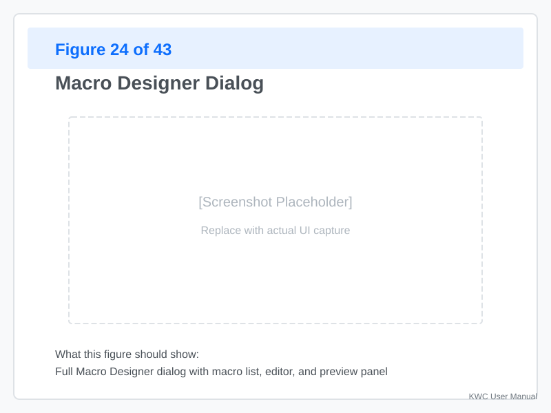
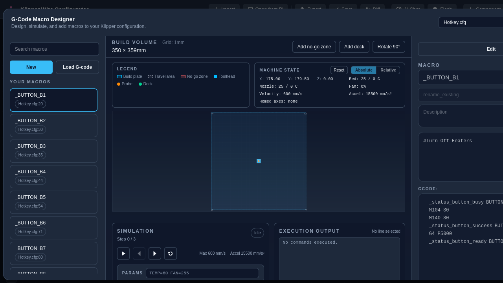
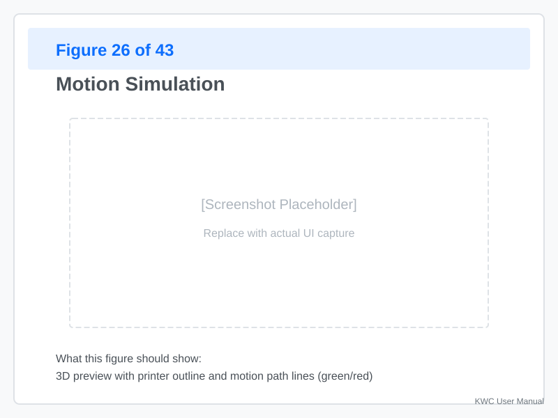
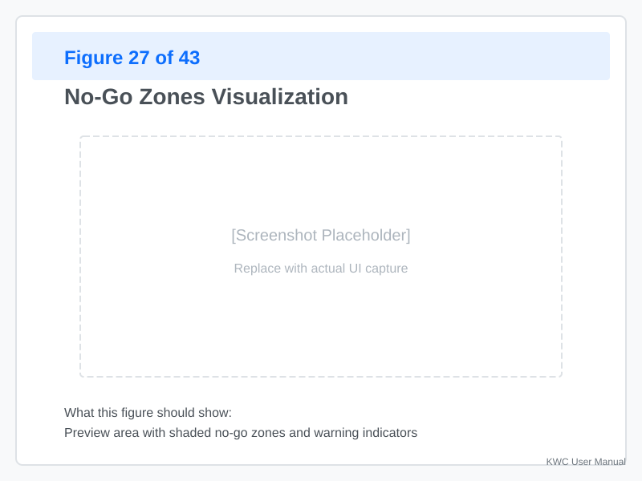

# Macro Designer

The **Macro Designer** provides a visual interface for creating and editing G-code macros. It includes motion simulation, no-go zones, and Jinja syntax validation.

---

## Opening the Macro Designer



**Click "Macro"** in the toolbar to open the designer.

When opened:
- A dialog appears (docked or floating, your choice is remembered)
- Your existing macros are listed on the left
- The editor opens for the selected macro
- The machine canvas and simulation controls appear at the bottom

---

## Interface Overview



### Macro List (Left)

Shows all macros in your config, with a **Search macros** box at the top:

**Actions:**
- **Click** — Open the selected macro in the editor.
- **Right-click** — Context menu to **Copy**, **Rename**, or **Delete** a draft macro.
- **"New" button** — Create a new, empty macro draft.
- **"Load G-code"** — Load a G-code file for playback (simulation only, not added to the config).

### Editor (Center)

The macro editor with syntax highlighting:

- **Section header** — `[gcode_macro MY_NAME]`
- **Parameters** — `description: ...`, `variable_...`
- **G-code body** — The actual G-code and Jinja

**Features:**
- **Jinja validation** — Errors shown as you type.
- **Line numbers** — Shown on the left.
- **"Commands" button** — Opens a searchable list of supported G-code commands; click one to append it.
- **Indent carry** — Pressing `Enter` keeps the current line's indentation.

### Motion Preview (Bottom)



Shows the printer's bed and toolhead path:

- **Green line** — Valid moves
- **Red line** — Moves outside bounds or through no-go zones
- **Current position** — Toolhead icon
- **Zoom/Pan** — Scroll to zoom, drag to pan

---

## Creating a New Macro

### From Scratch

**Steps:**
1. **Click "+"** in the macro list
2. **Enter a name** (e.g., `BED_LEVEL_CHECK`)
3. **Add a description** (optional but recommended)
4. **Write your G-code:**

```gcode
[gcode_macro BED_LEVEL_CHECK]
description: Check bed level at all probe points
gcode:
    G90                     # Absolute positioning
    G1 X50 Y50 Z10 F3000    # Move to center
    G1 X0 Y0 F3000          # Move to corner 1
    G1 X200 Y0              # Move to corner 2
    G1 X200 Y200            # Move to corner 3
    G1 X0 Y200              # Move to corner 4
    G1 X100 Y100 Z10        # Return to center
    M117 Bed level check complete
```

### From a G-code File

You can also load an existing G-code file for **playback** (simulation only — it is not added to your config):

1. **Click "Load G-code"** in the macro list
2. **Choose a G-code file**
3. Select it in the list and use the simulation controls to step through it
4. **Unload** removes the playback file

---

## Editing Macros

### Adding G-code Commands

**Type directly** into the editor. Common commands:

| Command | Purpose |
|---------|---------|
| `G0` / `G1` | Rapid/linear move |
| `G28` | Home axis |
| `M104` / `M109` | Set/wait hotend temp |
| `M140` / `M190` | Set/wait bed temp |
| `M117` | Display message on LCD |
| `SAVE_CONFIG` | Save to printer.cfg |

**Inserting commands:**
- Use the **"Commands" button** in the editor to open a searchable list of supported G-code commands and append one.

### Using Jinja2

Jinja2 allows conditional logic and variables:

**Variables:**
```jinja
{# Define a variable #}

M104 S{hotend_temp}
```

**Conditionals:**
```jinja

    M117 Right side of bed

    M117 Left side of bed

```

**Loops:**
```jinja

    G1 X{20 * i} Y50 F3000

```

**Accessing printer state:**
```jinja

M117 Current temp: {current_temp}°C
```

### Parameters and Variables

**Add macro parameters:**
```gcode
[gcode_macro MY_MACRO]
description: A macro with parameters
variable_temp: 200
gcode:
    M104 S{params.TEMP}
    M117 Heated to {variable_temp}
```

**Accessing parameters:**
```gcode
MY_MACRO TEMP=210
```

**Parameters vs. Variables:**
- **Parameters (`params.NAME`):** Passed at the time of calling the macro (e.g., `MY_MACRO TEMP=210`). These are temporary and reset with each call.
- **Variables (`variable_NAME`):** Defined within the macro block. These persist across multiple calls and can store state (e.g., a "parked" position).

## Motion Simulation and Validation

### No-Go Zones



**No-go zones** are areas where the printer should not move (e.g., filament spool holder, tool changer).

**Setting no-go zones:**
1. **Click "Add no-go zone"** in the machine toolbar — a zone appears in the center of the bed
2. **Move it** by dragging, or **resize** by dragging its edges/corners (a "Set exact position" dialog gives you precise X/Y/bounds)
3. **Right-click a zone** for context-menu actions (copy, delete)

The machine toolbar also has **Add dock** (sets the toolhead park/dock position) and **Rotate 90°** (view rotation).

**Zones are checked** during simulation.

### Move Validation

As you write G-code:

- **Green lines** — Moves within bounds
- **Red lines** — Moves outside bed or through no-go zones
- **Warning badge** — Visual indicator that a move intersects a No-Go Zone or exceeds physical bounds.

**Example:**
```gcode
G1 X-5 Y50 F3000  # ← Red: X is negative (outside bed)
G1 X250 Y50 F3000 # ← Red: X exceeds bed width
G1 X50 Y300 F3000 # ← Red: Z would exceed max (if Z probe offset applied)
```

### Z-Height Validation

**Max Z is checked:**
- If your macro moves higher than `max_z` in `printer.cfg`
- A warning appears: "Move exceeds max Z height"

**Relative positioning:**
```gcode
G91                 # Relative positioning
G1 Z5               # Moves 5mm up (checked against remaining travel)
G90                 # Back to absolute
```

---

## Testing Macros

### Simulate Before Saving

The machine canvas has on-screen simulation controls (no shortcuts):

- **Play/Pause** — Runs the simulation animation
- **Step back / Step forward** — Move through the simulated steps one at a time
- **Reset** — Return to the start of the simulation
- **Reset (machine)** — Stop the simulation, clear seeded commands, reset the toolhead to centered/cold

**Seed a command** — Type a G-code command (e.g., `G28`) in the seed box and **Send** to place the toolhead in a known state before simulating.

1. **Macro runs step-by-step** in the preview
2. **Toolhead path** is shown
3. **Validation errors** appear as red markers
4. **Final state** is displayed

**What's checked:**
- Bed bounds (X, Y, Z)
- No-go zones
- Pin conflicts (if configured)
- Jinja syntax errors

### Real-World Testing

**After saving the macro:**

1. **Restart Klipper** (if needed)
2. **Call the macro** via terminal or OctoPrint:
   ```
   BED_LEVEL_CHECK
   ```
3. **Watch the print** for unexpected behavior
4. **Check the log** for errors

---

## Common Patterns

### PRINT_START Macro

```gcode
[gcode_macro PRINT_START]
description: Setup at the start of every print
gcode:
    G28                     # Home all axes
    G90                     # Absolute positioning
    M140 S{params.BED_TEMP} # Heat bed
    M104 S{params.EXTRUDER_TEMP} # Heat hotend
    M117 Heating...         # Show status on display
    G1 X10 Y10 Z10 F3000    # Park position
    # Wait for temps
    M190 S{params.BED_TEMP}
    M109 S{params.EXTRUDER_TEMP}
    M117 Starting Bed Mesh...
    BED_MESH_CALIBRATE      # Bed mesh
    G1 X0 Y0 Z2 F3000       # Move to start
    M117 Ready to print!
```

**Parameters:**
- `BED_TEMP` — Bed temperature
- `EXTRUDER_TEMP` — Hotend temperature

### PAUSE/RESUME

```gcode
[gcode_macro PAUSE]
description: Pause the print and park
variable_park_x: 50
variable_park_y: 50
gcode:
    SAVE_GCODE_STATE NAME=PAUSE_state
    G91
    G1 Z10 F3000            # Lift Z
    G90
    G1 X{variable_park_x} Y{variable_park_y} F3000  # Park
    M117 Print paused

[gcode_macro RESUME]
description: Resume from pause
gcode:
    RESTORE_GCODE_STATE NAME=PAUSE_state
    M117 Print resumed
```

---

## Keyboard Shortcuts

| Shortcut | Action |
|----------|--------|
| `Delete` / `Backspace` | Delete the selected canvas item (no-go zone or dock) |

These are the only keyboard shortcuts in the Macro Designer. Simulation uses the on-screen Play/Pause, Step, and Reset buttons; the editor has no shortcuts.

---

## Troubleshooting

### Jinja Syntax Errors

**Error:** "Unexpected end of template" or "Invalid syntax"

**Common causes:**
- Missing `` or ``
- Unclosed ``
- Mismatched braces `{` `}`

**Solution:**
1. **Check each Jinja block** — Every ``
2. **Use the validator** — Designer highlights errors in red
3. **Simplify first** — Test without Jinja, then add complexity

### Motion Exceeds Bounds

**Error:** "Move exceeds bed bounds"

**Check:**
1. **Bed dimensions** — Are they correct in `printer.cfg`?
2. **No-go zones** — Are you accidentally drawing too large?
3. **Home position** — Is your `X_MIN` / `Y_MIN` set correctly?

**Solution:**
- Adjust your G-code moves
- Update `printer.cfg` bed dimensions
- Resize no-go zones

### Macro Doesn't Call

**Problem:** You defined the macro but calling it does nothing.

**Check:**
1. **Klipper restarted** — New macros require a restart
2. **No syntax errors** — Check `printer.log`
3. **Name matches** — `MY_MACRO` vs `my_macro` (case-sensitive)

---
