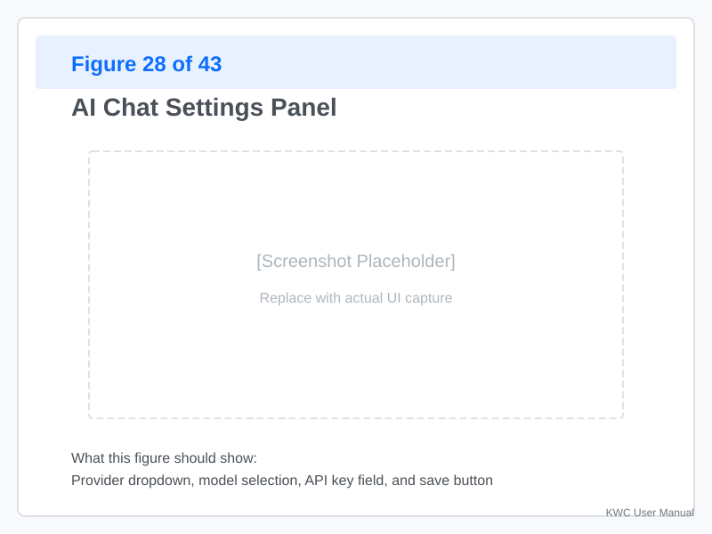
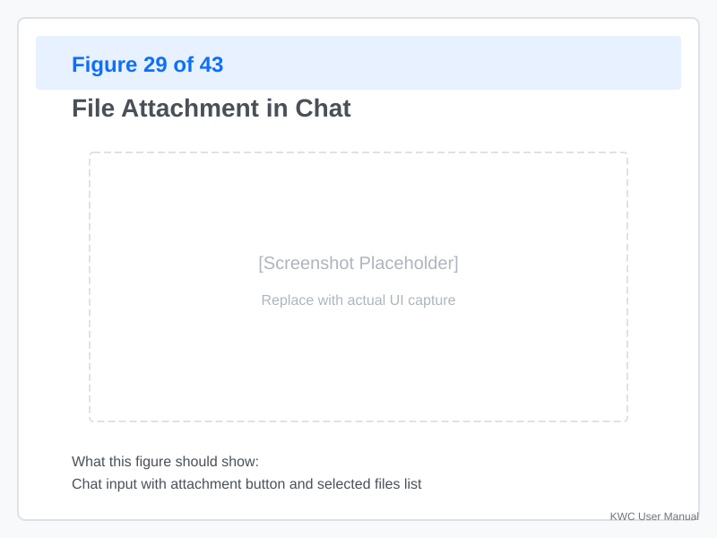
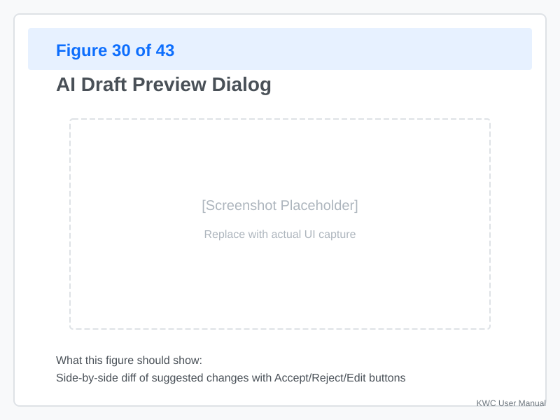

# AI Chat

The **AI Chat** feature provides context-aware assistance powered by large language models. It understands your configuration, accesses Klipper documentation, and can propose edits.

---

## Setting Up AI Chat

### First-Time Configuration



**Click "AI Chat"** in the toolbar, then click **Settings** (gear icon).

**Choose your provider:**

| Provider | Type | Notes |
|----------|------|-------|
| **OpenAI** | Cloud | Requires API key, most capable |
| **Google Gemini** | Cloud | Requires API key, good for code |
| **Anthropic Claude** | Cloud | Requires API key, strong reasoning |
| **GitHub Copilot** | Cloud | Requires API key, code-focused |
| **OpenAI-Compatible** | Local/Cloud | Works with LM Studio, Ollama, local servers |

### Provider Configuration

**For cloud providers:**
1. **Select a provider** from the dropdown menu.
2. **Enter your API key** (stored locally; never sent to KWC servers).
3. **Select a model** (e.g., `gpt-4`, `gemini-pro`).
4. **Click "Save"**.

**For local/OpenAI-compatible providers:**
1. **Select "OpenAI-Compatible"**
2. **Enter host/port** (e.g., `localhost:1234`)
3. **Leave API key blank** (or enter if required)
4. **Click "Save"**

**Model selection:**
- Cloud providers: Auto-populated with available models
- Local providers: Fetches models from your server's `/v1/models` endpoint

### Testing the Connection

After saving:
1. **Try a simple question:** "What is a Klipper macro?"
2. **Check the status** — Green indicates success
3. **Watch for errors** — Red indicates connection issues

---

## Using the Chat

### Basic Questions

**Ask about Klipper concepts:**
```
How do I set up a probe?
What is the difference between BED_MESH_CALIBRATE and QUAD_GANTRY_LEVEL?
How do I tune my PID?
```

**The AI will:**
- Search Klipper documentation via MCP tools
- Provide context from your config if attached
- Cite sources (e.g., "From Config_Reference.md:")

### Attaching Configuration Context



**To provide config context:**

1. **Click the paperclip icon** (or drag files into chat)
2. **Select loaded files** (from your current project)
3. **Or attach local files** from your computer

**What gets sent:**
- Only **checked** files are included
- **Targeted sections** (if you mention them)
- **Section index** (if no specific section is named)

**Example:**
```
Can you help me tune my probe?
[Attached: printer.cfg, probe.cfg]
```

The AI reads your probe configuration and provides specific advice.

### Asking for Edits

**The AI can propose changes to your config:**

```
Add a G28 before my print_start macro
Increase my bed mesh points to 5x5
Create a new macro for homing all axes
```

**How it works:**
1. **AI analyzes** your current config
2. **Proposes edits** using mini-diff format
3. **You review** in the Draft Preview dialog
4. **Accept or reject** each change

**Mini-diff format:**
```
#[stepper_x]
-rotation_distance: 39.5
+rotation_distance: 40
```

---

## The Draft Preview Workflow



After the AI proposes changes:

### Step 1: Review Changes

**The preview shows:**
- **Green lines** — What will be added
- **Red lines** — What will be removed
- **Gray lines** — Context (unchanged)

**Per-file tabs:**
- If multiple files are affected, click tabs to review each
- **New files** are shown with a "New" badge

### Step 2: Validate

Before accepting:
1. **Click "Validate"** — KWC checks for errors
2. **Review any warnings** — Red badges block acceptance
3. **Fix issues** if needed (AI can help)

### Step 3: Accept or Reject

**Options:**
- **Accept all** — Apply all proposed changes
- **Accept per-file** — Click "Accept" on each file tab
- **Reject** — Discard all changes
- **Request revision** — Ask the AI to modify the proposal

**After accepting:**
- Changes are staged in KWC
- Use **Diff** to review before saving
- Use **Save/Export** to persist

---

## Persistent Context (Printer Memory)

### What is Printer Memory?

Printer Memory is a structured JSON object that the AI can update to remember your printer's configuration:

```json
{
  "bed_mesh_profile": "default",
  "pid_bed_temp": 60,
  "pid_hotend_temp": 200,
  "homming_origin": "bed_mesh"
}
```

### How It Works

1. **Current memory** is sent as context
2. **AI can propose updates** in a `printer-memory` block
3. **You review** in the Printer Memory dialog
4. **On acceptance** — Memory is updated and persisted

**Example:**
```
User: What bed mesh profile am I using?
AI: Your current profile is "default" at 22°C.
    Should I create a new profile for higher temps?

[Printer Memory proposal appears]
```

### Managing Memory

**Open Memory Dialog:**
- Click the **memory icon** in the chat
- Or ask: "Show me my printer memory"

**Actions:**
- **View** current values
- **Edit** manually
- **Reset** to defaults
- **Clear** all memory

---

## How the AI Finds Information (MCP Tools)

The AI uses **MCP (Model Context Protocol)** — a standard for connecting AI to external data — to perform actions automatically when needed:

### Available Tools

| Tool | Purpose |
|------|---------|
| `read_user_config` | Fetch specific sections from your config |
| `read_klipper_doc` | Search Klipper documentation |
| `search_examples` | Find example configurations |
| `validate_macro` | Check G-code macro syntax and bounds |
| `calculate_rotation_distance` | Compute stepper rotation distance |
| `list_sections` | List all sections in a file |

### Tool Use in Chat

When the AI needs information, it uses tools silently:

```
User: How do I set up my Eddy probe?
AI: [Uses read_klipper_doc → searches for "Eddy"]
    Based on the documentation...
```

**You can see tool usage** in the chat footer:
- ✅ `read_klipper_doc` — Tool executed successfully
- ❌ `validate_macro` — Tool returned an error

---

## Conversation History

### Saving Conversations

**Click the save icon** (floppy disk) to save a conversation:

1. **Enter a name** (e.g., "PID Tuning Session")
2. **Select what to save:**
   - Messages only
   - Messages + attached config files
   - Messages + provider settings

**Saved conversations** appear in the History dialog.

### Loading Conversations

**Open History** (clock icon):
1. **Browse saved conversations**
2. **Click to load**
3. **Resume chat** with full context restored

### Deleting Conversations

**Right-click a conversation** in History:
- **Delete** — Remove permanently
- **Export** — Save as JSON

---

## Keyboard Shortcuts

| Shortcut | Action |
|----------|--------|
| `Ctrl+Enter` | Send message |
| `Esc` | Stop generation |
| `Ctrl+L` | New chat |
| `Ctrl+H` | Open history |
| `Ctrl+,` | Open settings |

---

## Troubleshooting

### AI Doesn't Respond

**Possible causes:**
- **Network issue** — Check your connection
- **API key invalid** — Re-enter in settings
- **Rate limit exceeded** — Wait and retry
- **Model unavailable** — Switch to a different model

**Solution:**
1. **Check status icon** — Red indicates connection issues
2. **Verify API key** — Settings → Test Connection
3. **Try a different model** — Some models have higher latency

### AI Suggests Invalid Changes

**Problem:** The AI proposes edits that fail validation.

**Solution:**
1. **Review the draft** — See what was proposed
2. **Click "Validate"** — Identify specific errors
3. **Ask AI to revise** — "Fix the validation errors in your proposal"
4. **Provide more context** — Attach relevant files

**Common errors:**
- Missing required parameters
- Duplicate section names
- Invalid pin assignments

### Tool Calls Fail

**Problem:** The AI tries to use a tool but it fails.

**Possible causes:**
- Tool arguments are invalid
- Your config is incomplete
- The documentation file is missing

**Solution:**
1. **Check the error message** — Shown in chat footer
2. **Provide more context** — Attach the relevant file
3. **Ask AI to try a different approach** — "Can you answer without using tools?"

### Slow Responses

**Causes:**
- Cloud API latency (common with GPT-4)
- Local model is small/slow
- Complex query requiring multiple tool calls

**Mitigation:**
- Use faster models (GPT-3.5 vs GPT-4)
- Simplify your query (ask smaller questions)
- For local models, try a larger model if RAM allows

---

## Best Practices

### Effective Prompts

**Good prompts:**
- "Add a BED_MESH_CALIBRATE to my print_start macro"
- "Explain why my probe offset is wrong"
- "Create a macro that homes X and Y, then probes at 5 points"

**Bad prompts:**
- "Fix everything" (too vague)
- "Make my printer work" (not actionable)
- "Change the config" (no specifics)

### Context Management

**Attach only what you need:**
- ✅ "Here's my probe.cfg, how do I adjust the offset?"
- ❌ Attach whole project for a single-section question

**Pro Tip:** If the AI is hallucinating configuration values, try "unchecking" other files to force it to focus only on the specific file you are currently editing.

**Reference specific files:**
- "In `printer.cfg`, what's wrong with my stepper_x?"
- "Look at `macros.cfg` and explain the PAUSE macro"

### Iterative Refinement

**When the AI gets it wrong:**
1. **Don't accept** the draft
2. **Point out the issue** — "You added G28 but I asked for G90"
3. **Provide a corrected example** — "Like this: [paste correct code]"
4. **Ask for revision** — "Please fix this"

---
