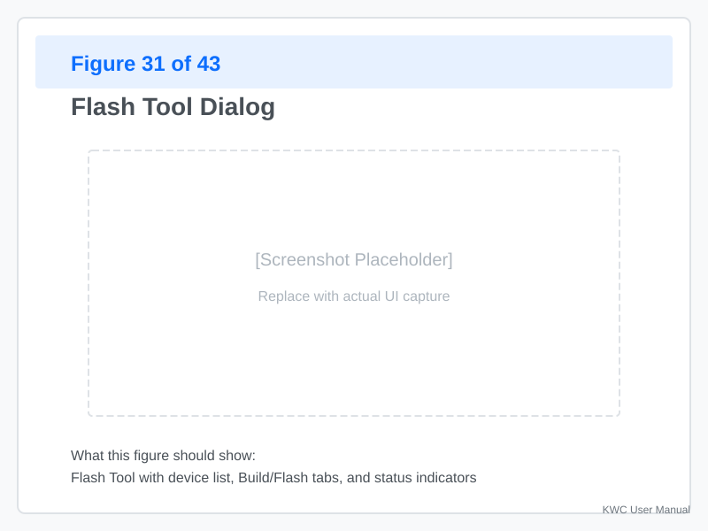
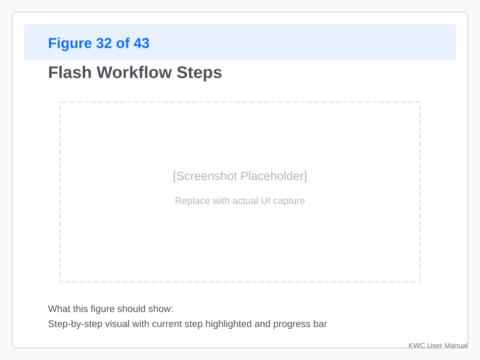
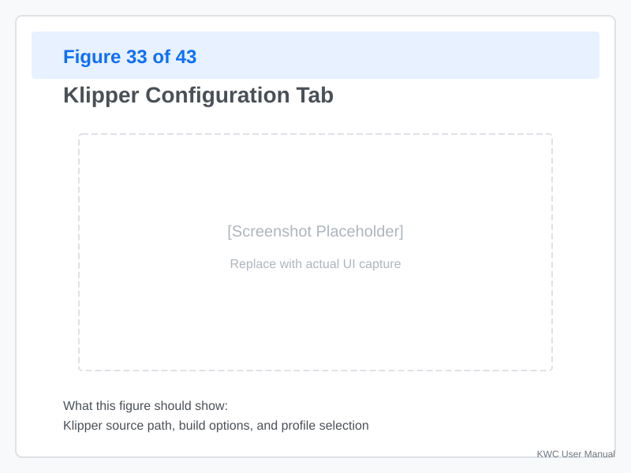
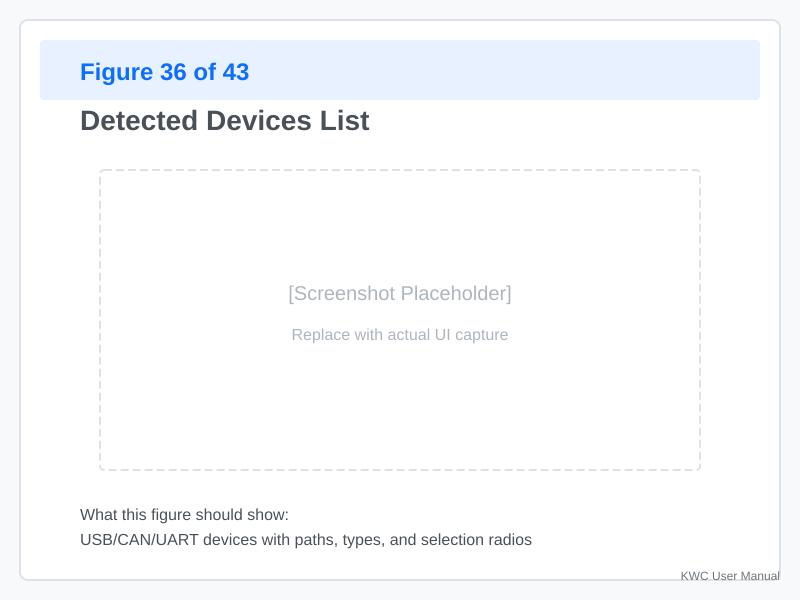

# Flash Tool

The **Flash Tool** lets you build and flash Klipper firmware (and Katapult bootloaders) directly from KWC on supported hardware.

---

## Prerequisites

The Flash Tool is available when:
- KWC can reach the **Klipper** and **Katapult** source checkouts on your system (the checkout paths are shown and can be overridden in the dialog's **settings gear**)
- You have **build tools** installed (gcc, make, etc.)

### Build Tools

If you have not installed build tools:

```bash
sudo apt update
sudo apt install gcc make libncurses5-dev bison build-essential
```

---

## Opening the Flash Tool



**Click "Flash"** in the toolbar.

When opened:
- The Flash dialog appears with a **Klipper** tab (and a **Katapult** tab — only shown when a Katapult checkout is present)
- The menuconfig preview for the selected target is shown
- Build and flash options are available

---

## Flash Workflow Overview



The typical workflow:

1. **Select target** — Klipper or Katapult, and the board
2. **Menuconfig preview** — review and adjust the menuconfig fields for the selected board
3. **Save** — write the active `.config` file (optionally store the setup as a named profile)
4. **Build** — compile the firmware locally
5. **Flash** — KWC detects the target device and matches a flash method

---

## Menuconfig Preview



The dialog shows a **live preview of the menuconfig fields** relevant to the selected board:

- **Changes update the visible menuconfig fields immediately** — there is no separate "edit Kconfig" step
- When the current selection has no applicable options, you see: *"No visible menuconfig options are available for the current selection."*
- **Save** writes the active `.config` file for the target

Use the **settings gear** in the dialog to:
- Override the **Klipper/Katapult checkout paths**
- **Refresh detected flash devices**

---

## Flash Profiles

KWC keeps **host-side flash profiles** so you can reuse a flash setup (the saved `.config` state for a target) without re-doing the menuconfig work:

- **Save** — after writing the active `.config` file, KWC offers to store the current flash setup under a **unique profile name**
- **Load** — opens the active config, or any saved profile, for the current target
- The **profile dialog** lists your profiles with **Load** and **Delete** buttons for each

Profiles are stored on the host in `~/.config/klipper-wire-configurator/flash_profiles/` (a per-target subdirectory with JSON files). They never touch your printer — they are a KWC convenience for re-applying build settings.

---

## Building Firmware

### Start Build

**Click "Build"** for the selected target:

1. **KWC builds locally** in the Klipper checkout
2. A **progress indicator** shows the build status
3. On failure, the **build log** is shown so you can see the error

**Build time:**
- **First build:** several minutes
- **Incremental builds:** much faster

### Build Output

After a successful build, the dialog shows the firmware output for the target so you can proceed to flashing.

### Build Errors

**Common errors:**

| Error | Cause | Solution |
|-------|-------|----------|
| `gcc: command not found` | Build tools missing | Install build tools |
| `No such file: Kconfig` | Klipper source missing | Check the checkout path (settings gear) |
| **Source Version** | Building a different Klipper version than expected | Check the checkout path and `git branch` in it |
| `Out of memory` | System ran out of RAM | Close other apps, retry |

**Check the build log** (shown on failure) for detailed error messages.

---

## Flashing Firmware

### Detect Flash Targets

KWC scans for flashable devices:



**Detected devices include:**

| Device Type | Example | Flash Method |
|-------------|---------|--------------|
| USB DFU | `0483:df11` | dfu-util |
| USB Serial | `/dev/ttyACM0` | serial (make flash / flashtool) |
| CAN Bus | CAN UUID | CAN boot |
| RP2040 boot drive | `RPI-RP2` | make flash |

The flash method is **auto-matched to the detected device**, and you can override it manually if needed.

Use **Refresh detected flash devices** in the settings gear after plugging in hardware.

### Start Flash

**Click "Flash"** to begin:

1. **Enter bootloader mode** if required by your hardware (some boards auto-enter on USB connect; others need a manual reset)
2. **Upload firmware** — progress is shown
3. **Reset** — the board resets with the new firmware

For **RP2040 boards** (e.g., Raspberry Pi Pico), the `make flash` method handles the boot drive: hold **BOOTSEL**, connect via USB, and KWC flashes the `.uf2` when the `RPI-RP2` drive appears. (The same thing works by hand — drag the `.uf2` onto the drive — but KWC's flash method does it for you.)

---

## Katapult Bootloader

### What is Katapult?

**Katapult** is a bootloader for STM32 boards that:
- Enables firmware updates over USB/CAN
- Provides a consistent flashing interface
- Supports multiple boards (Spider, BTT, etc.)

### Flashing Katapult

The **Katapult tab** is only shown when a Katapult checkout is present.

1. **Select your board**
2. **Save** the menuconfig
3. **Build** — compile the Katapult bootloader
4. **Flash** — upload to the target board

**Use cases:**
- **First-time flash** — install Katapult on a blank board
- **Upgrade Katapult** — update to a newer version
- **Recover a bricked board** — re-flash the bootloader

---

## Troubleshooting

### Build Fails

**Error:** `make: *** No targets specified and no makefile found.`

**Cause:** Klipper source not found at the checkout path

**Solution:**
1. Check the checkout path in the settings gear
2. Update the source if needed:
   ```bash
   cd ~/klipper
   git pull
   ```
3. Rebuild in KWC

### Flash Fails: "No device found"

**Possible causes:**
- Board not in bootloader mode
- Wrong device path
- USB cable issues
- **Permissions:** user not in `dialout` group or missing udev rules

**Solution:**
1. **Refresh detected flash devices** (settings gear)
2. **Put the board in bootloader mode** — reset, hold BOOTSEL, etc.
3. **Try a different USB port/cable**
4. **Check permissions** — ensure your user is in the `dialout` group: `sudo usermod -aG dialout $USER`

### Flash Fails Mid-Transfer

**Cause:** Firmware transfer interrupted or corrupted

**Solution:**
1. **Retry** — sometimes a fluke
2. **Check USB connection** — loose connection
3. **Try a different flash method** — override the auto-matched method
4. **Rebuild** — the output file may be incomplete

### Katapult Detection Fails

**Problem:** Board has Katapult but KWC does not detect it.

**Check:**
1. **Board is in Katapult mode** — some boards dual-boot
2. **USB permissions** — does KWC have access to `/dev/ttyACM*`?
3. **Re-scan** — Refresh detected flash devices

---

## Best Practices

### Before Flashing

1. **Note your menuconfig** — Save a named flash profile of the working setup
2. **Test on a spare board first** if you can
3. **Have a recovery plan** — keep a known-good firmware ready

### During Development

1. **Use incremental builds** — faster iteration
2. **Test Katapult first** — easier recovery if something breaks

### For Production

1. **Version your firmware** — note the Klipper commit you built
2. **Test thoroughly** — verify on real hardware before deployment
3. **Save a flash profile** — so the exact setup can be rebuilt later

---

## Appendix: Manual Flash Reference

If KWC flash fails, you can flash manually:

```bash
# Navigate to build output
cd ~/klipper/out

# STM32 DFU
dfu-util -d 0483:df11 -a 0 -s 0x08000000 -D klipper.bin

# RP2040 drag-and-drop
cp klipper.uf2 /media/pi/RPI-RP2/

# Make-based (serial / boot drive)
cd ~/klipper && make flash FLASH_DEVICE=/dev/ttyACM0
```

---
