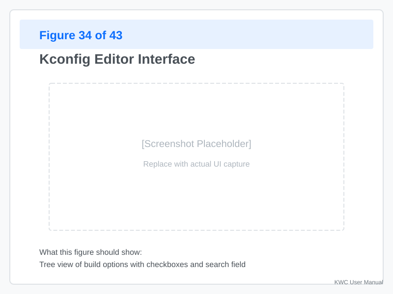
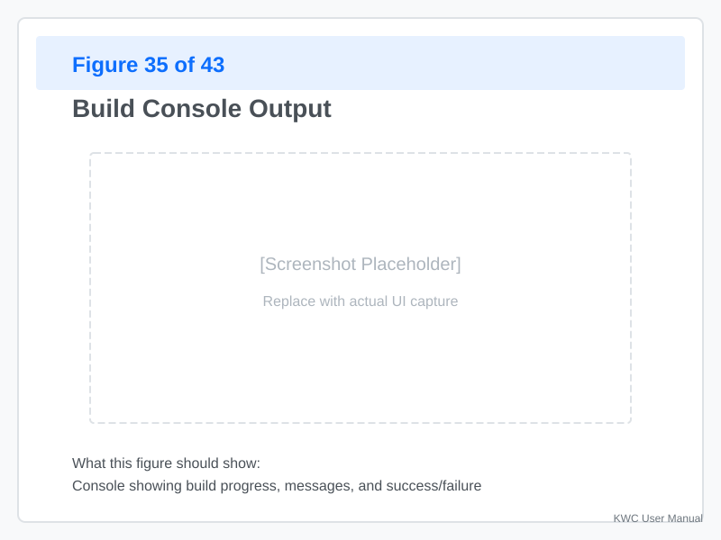

# Flash Tool

The **Flash Tool** lets you build and flash Klipper firmware (and Katapult bootloaders) directly from KWC when running in Native Mode on a Raspberry Pi.

---

## Prerequisites

### Native Mode Required

The Flash Tool is only available when:
- KWC is running **natively** on a Raspberry Pi
- You have **access** to the Klipper/Katapult source trees
- You have **build tools** installed (gcc, make, etc.)

### Build Tools

If you haven't installed build tools:

```bash
sudo apt update
sudo apt install gcc make libncurses5-dev bison build-essential
```

---

## Opening the Flash Tool


**Click "Flash"** in the toolbar (native mode only).

When opened:
- The Flash dialog appears with tabs for **Klipper** and **Katapult**
- Current configuration is shown
- Build and flash options are available

---

## Flash Workflow Overview


The typical workflow:

1. **Select target** — Klipper or Katapult
2. **Configure** — Set your board and options
3. **Build** — Compile the firmware
4. **Choose device** — Select the target microcontroller
5. **Flash** — Upload the firmware

---

## Configuring Klipper

### Target Selection


**Select your target:**
- **Click "Klipper" tab**
- **Choose your board** from the dropdown:
  - Raspberry Pi (for SBC)
  - Fysetc Spider
  - MKS Robin
  - BigTreeTech SKR
  - Custom/Other

### Board-Specific Options

**Common options:**

| Option | Purpose | Example |
|--------|---------|---------|
| MCU type | Mainboard or SBC | `armv6l` (Pi 3B) |
| Clock speed | Processor frequency | `48000000` (48 MHz) |
| Bootloader | Flash method | `catapult`, `stk500` |
| USB device | Serial path | `/dev/ttyACM0` |

**Platform-specific settings:**
- **Pi 3B:** `linux-armv7l` or `linux-armv6l`
- **Pi 4:** `linux-aarch64`
- **Spider:** `atmega2560` or `stm32`
- **STM32 boards:** Select clock source (external/crystal, internal/RC)

### Kconfig Editor



**Advanced configuration:**
- **Click "Edit Kconfig"** to view advanced options
- **Enable/disable features** like:
  - BLTouch support
  - Eddy/Toolhead probes
  - Additional G-codes
  - Logging levels

**Changes are previewed** before building.

---

## Building Firmware

### Start Build

**Click "Build"** in the Klipper tab:

1. **KWC reads** current Kconfig
2. **Clean build** (if needed)
3. **Compile** with make
4. **Progress bar** shows build status

**Build time:**
- **First build:** 3-5 minutes
- **Incremental builds:** 30-60 seconds

### Build Output

After a successful build:



**The output shows:**
- **Firmware location** — Path to compiled `.bin` or `.uf2`
- **Size** — Firmware file size
- **Download link** — Save to computer (browser mode)
- **Flash devices** — List of detected flash targets

### Build Errors

**Common errors:**

| Error | Cause | Solution |
|-------|-------|----------|
| `gcc: command not found` | Build tools missing | Install build tools |
| `No such file: Kconfig` | Klipper source missing | Clone Klipper repo |
| `Invalid option` | Kconfig error | Review Kconfig editor |
| `Out of memory` | Pi ran out of RAM | Close browser tabs/apps, retry |
| **Source Version** | Building wrong Klipper version | Check `git branch` in `~/klipper` folder |

**Check the log** for detailed error messages.

---

## Flashing Firmware

### Detect Flash Targets

After building, KWC scans for flashable devices:


**Detected devices:**

| Device Type | Example | Flash Method |
|-------------|---------|--------------|
| USB Serial | `/dev/ttyACM0` | DFU, stk500 |
| CAN Bus | `can0` | CAN boot |
| RP2040 Mass Storage | `RPI-RP2` | Drag-and-drop |
| STM32 DFU | `0483:df11` | DFU |
| UART | `/dev/serial/by-id/...` | bootloader |

### Select Flash Method

**Click a detected device** or manually select:

1. **Choose flash method:**
   - **DFU** — For STM32 boards in DFU mode
   - **Serial** — For UART/USB serial
   - **CAN** — For CAN bus flash
   - **Mass Storage** — For RP2040 drag-and-drop

2. **Configure parameters** (if needed):
   - **Baud rate** — For serial flashing
   - **Interface** — For CAN (can0, can1)
   - **Device path** — For USB serial

### Start Flash

**Click "Flash"** to begin:

1. **Enter bootloader mode** (if required by your hardware)
   - Some boards require manual reset
   - Some auto-enter on USB connect
2. **Upload firmware** — Progress bar shows status
3. **Verify** — Checksum verification
4. **Reset** — Board resets with new firmware

**Success message:**
```
✓ Flash successful!
Firmware: klipper.bin
Size: 128KB
Device: /dev/ttyACM0
Time: 12 seconds
```

---

## Katapult Bootloader

### What is Katapult?

**Katapult** is a bootloader for STM32 boards that:
- Enables easy firmware updates over USB/CAN
- Provides a consistent flashing interface
- Supports multiple boards (Spider, BTT, etc.)

### Flashing Katapult

**Steps:**

1. **Switch to "Katapult" tab**
2. **Select your board** from the dropdown
3. **Configure** (if needed) — Most settings are pre-configured
4. **Build** — Compile Katapult bootloader
5. **Flash** — Upload to the target board

**Use cases:**
- **First-time flash** — Install Katapult on a blank board
- **Upgrade Katapult** — Update to newer version
- **Recover bricked board** — Re-flash bootloader

### Katapult Detection

After Katapult is installed:
- **KWC detects** it automatically
- **Firmware updates** use Katapult instead of raw flash
- **CAN flashing** becomes possible

---

## Drag-and-Drop Flashing (RP2040)

### RP2040 Mass Storage Mode

For RP2040 boards (e.g., Raspberry Pi Pico):


**Steps:**
1. **Hold BOOTSEL button** on the Pico
2. **Connect via USB** — Appears as `RPI-RP2` drive
3. **KWC detects** the drive automatically
4. **Drag firmware** (`firmware.uf2`) onto the drive
5. **Board resets** with new firmware

**KWC automates this:**
- Click **"Flash via USB"**
- Drag the `.uf2` file when prompted
- Done!

---

## Flash Profiles

### What Are Profiles?

**Flash profiles** save your configuration for quick reuse:

- **Profile name** — e.g., "Spider with Katapult"
- **Target** — Klipper or Katapult
- **Board** — Fysetc Spider
- **Flash device** — `/dev/ttyACM0`
- **Flash method** — DFU

### Creating a Profile

**After configuring a build:**

1. **Click "Save Profile"**
2. **Enter a name** (e.g., "Spider-Katapult-DFU")
3. **Profile is saved** for future use

### Using a Profile

**To re-flash with a saved profile:**

1. **Open Flash Tool**
2. **Select profile** from dropdown
3. **Click "Build & Flash"** — Full workflow with one click

**Profiles are stored** in:
- `~/.config/klipper-wire-configurator/flash_profiles/`

---

## Troubleshooting

### Build Fails

**Error:** `make: *** No targets specified and no makefile found.`

**Cause:** Klipper source not found

**Solution:**
```bash
cd ~/klipper
git pull
# Rebuild in KWC
```

### Flash Fails: "No device found"

**Possible causes:**
- Board not in bootloader mode
- Wrong device path
- USB cable issues
- **Permissions:** User not in `dialout` group or missing udev rules

**Solution:**
1. **Check device list** — Does your board appear?
2. **Manual reset** — Put board in bootloader mode
3. **Try different USB port/cable**
4. **Verify device path** — Check `/dev/` for new devices
5. **Check permissions** — Ensure your user is in the `dialout` group: `sudo usermod -aG dialout $USER`

### Flash Fails: "Verification error"

**Cause:** Firmware corrupted during transfer

**Solution:**
1. **Retry** — Sometimes a fluke
2. **Check USB connection** — Loose connection
3. **Try different flash method** — e.g., Serial vs DFU
4. **Rebuild** — Source file may be corrupted

### Katapult Detection Fails

**Problem:** Board has Katapult but KWC doesn't detect it.

**Check:**
1. **Board is in Katapult mode** — Some boards dual-boot
2. **USB permissions** — Does KWC have access to `/dev/ttyACM*`?
3. **Re-scan** — Click "Refresh Devices"

---

## Best Practices

### Before Flashing

1. **Backup current firmware** — Save before overwriting
2. **Document settings** — Note your Kconfig changes
3. **Test locally** — Try on a spare board first
4. **Have a recovery plan** — Keep a working firmware ready

### During Development

1. **Use incremental builds** — Faster iteration
2. **Keep profiles** — Save common configurations
3. **Test Katapult first** — Easier recovery if something breaks
4. **Log changes** — Note what you changed between builds

### For Production

1. **Version your firmware** — Tag builds with dates/versions
2. **Test thoroughly** — Verify on real hardware before deployment
3. **Document process** — Record the exact steps for reproducibility
4. **Keep source** — Archive the exact Klipper commit used

---

## Appendix: Flash Commands Reference

### Common Flash Methods

| Method | Command | Notes |
|--------|---------|-------|
| DFU | `dfu-util -d 0483:df11 -a 0 -s 0x08000000 -D firmware.bin` | STM32 DFU |
| Serial | `avrdude -c stk500v2 -p m2560 ...` | Arduino/AVR |
| CAN | `python3 -m canboot flash ...` | CAN boot |
| Mass Storage | Copy `.uf2` to drive | RP2040 |

### Manual Flash via SSH

If KWC flash fails, you can flash manually:

```bash
# Navigate to build output
cd ~/klipper/out

# DFU example
dfu-util -d 0483:df11 -a 0 -s 0x08000000 -D klipper.bin

# Serial example
avrdude -c stk500v2 -p m2560 -P /dev/ttyUSB0 -b 115200 -U flash:w:klipper.bin

# RP2040 drag-and-drop
cp klipper.uf2 /media/pi/RPI-RP2/
```

---
