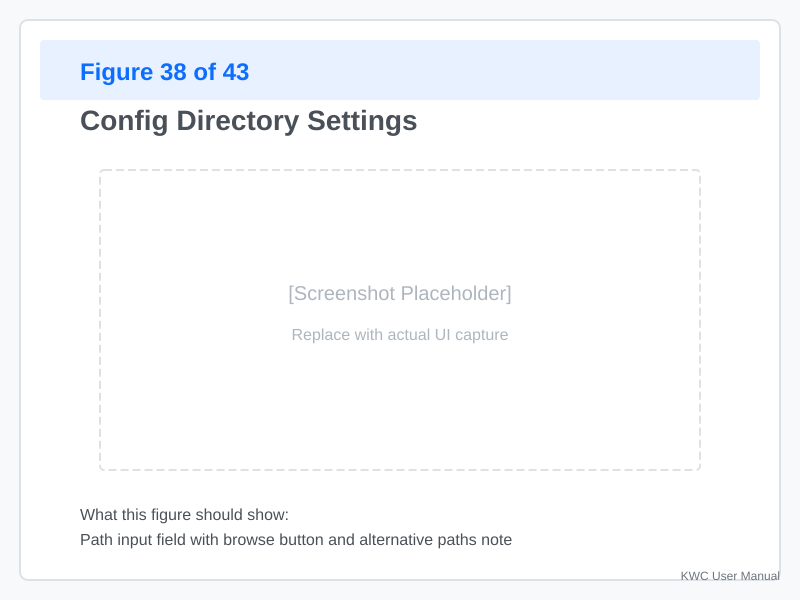
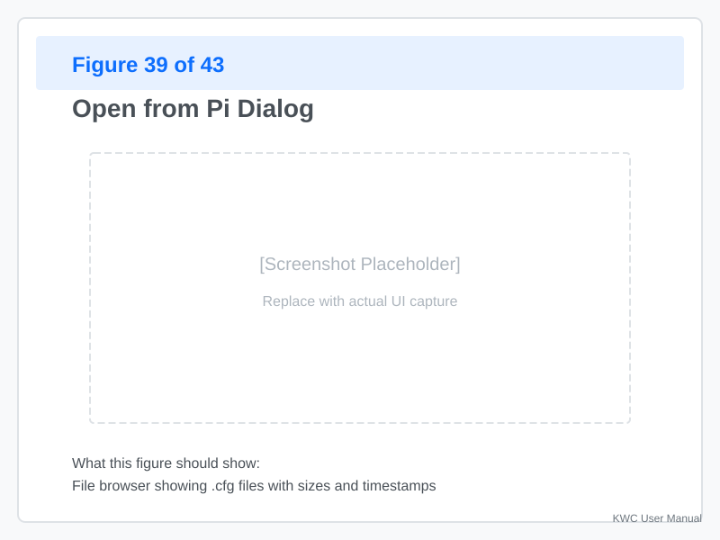
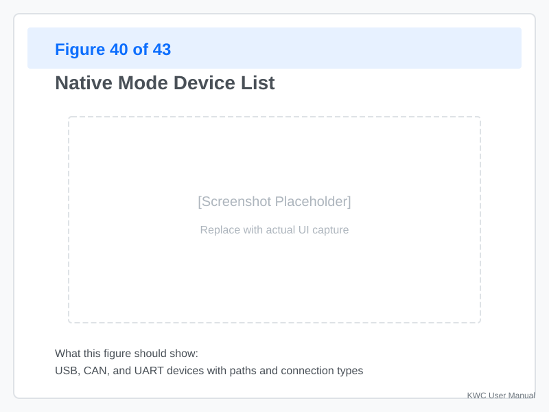
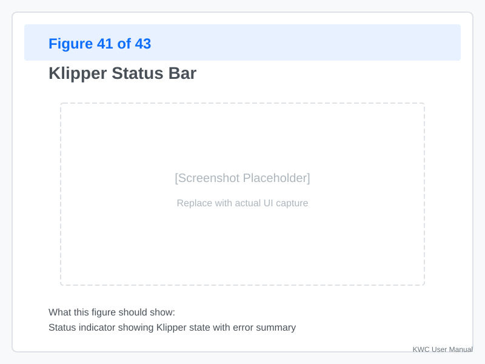

# Native Mode

**Native Mode** is when KWC runs directly on your Raspberry Pi, providing direct access to your printer's config files, hardware devices, and Klipper service.

---

## What Is Native Mode?

### Browser Mode vs. Native Mode

| Feature | Browser Mode | Native Mode |
|---------|--------------|-------------|
| **Location** | Any computer with a browser | Raspberry Pi with KWC installed |
| **File access** | Upload/download only | Direct read/write to disk |
| **Devices** | Not accessible | USB, CAN, UART devices visible |
| **Klipper control** | Not available | Start/stop/restart Klipper |
| **Firmware tool** | Not available | Build and flash firmware |
| **Best for** | Designing on PC | Deploying and tuning on Pi |

### When You're in Native Mode

**Indicators:**
- **"Open from Pi"** button appears in toolbar
- **"Save"** button writes directly to disk
- **"Flash"** button is available for firmware building
- **"Pi"** icon appears in the status bar

---

## Installing KWC on Your Pi

### Installation Steps

**Run the installer on your Raspberry Pi:**

```bash
# SSH into your Pi
ssh pi@<your-pi-ip>

# Download and run the installer
curl -sSL https://raw.githubusercontent.com/SartorialGrunt0/Klipper-Wire-Configurator/main/scripts/install.sh | bash
```

**The installer will:**
1. **Check dependencies** — Python 3.11+, Node.js, build tools
2. **Install missing packages** — Via apt
3. **Clone the repo** — From GitHub
4. **Build the frontend** — Run `npm install && npm run build`
5. **Create systemd service** — Auto-start on boot
6. **Verify startup** — Check that the service is running

### Accessing KWC

After installation:

- **Local access:** `http://localhost:8099` (on the Pi)
- **Remote access:** `http://<your-pi-ip>:8099` (from another computer)
- **Default port:** 8099 (configurable)

**To find your Pi's IP:**
```bash
# On the Pi
hostname -I

# Or check your router's connected devices list
```

### Updating KWC

To update KWC to the latest version, simply run the installer again. It will detect the existing installation and update the files and service.

---

## Config Directory

### Default Path

KWC looks for configs in:
```
~/printer_data/config/
```

**This is the default** for Moonraker/Klipper installations.

### Changing the Config Path



**To change the config directory:**

1. **Click the settings icon** (gear) in the status bar
2. **Select "Config Directory"**
3. **Enter the new path** (e.g., `~/klipper_config`)
4. **KWC scans** the directory for `.cfg` files
5. **Files appear** in the "Open from Pi" dialog

**Common alternative paths:**
- `~/klipper_config/` (traditional Klipper)
- `~/printer_data/config/` (Moonraker default)
- `/etc/klipper/` (system-wide)

---

## Opening Configs from Your Pi



**Click "Open from Pi"** in the toolbar.

**The dialog shows:**
- **All `.cfg` files** in the config directory
- **File size** and **last modified** timestamp
- **Multi-select** — Hold `Shift` to select multiple files

**Select files and click "Open":**
- Single file — Loads as `printer.cfg`
- Multiple files — KWC attempts to identify the main file
- Includes — KWC resolves `[include *.cfg]` statements

---

## Device Detection

### USB Serial Devices



KWC automatically detects:
- **USB-serial adapters** — FTDI, CP2102, etc.
- **RP2040 boards** — Raspberry Pi Pico, etc.
- **STM32 boards** — Spider, SKR, etc.

**Detected devices show:**
- **Device path** — `/dev/ttyACM0`, `/dev/ttyUSB0`
- **Description** — "FTDI USB Serial"
- **By-ID path** — Stable identifier (e.g., `usb-FTDI_FT232R...`)

### CAN Bus Devices

**For CAN-connected printers:**

1. **Ensure CAN is configured** — `can0` interface active
2. **KWC queries** CAN UUIDs via `canbus_uuid_query`
3. **Detected CAN devices** appear in the device list

**Example:**
```
Interface: can0
UUID: 123456789ABCDEF
Device: Toolhead CAN
```

### UART Devices

**UART-connected boards** (e.g., SPI or direct UART):
- Detected if the interface is enabled in `/boot/config.txt` (e.g., `dtoverlay=spidev0,apa102`).
- These typically appear as `/dev/spidev*` or similar depending on your hardware configuration.

---

## Klipper Service Control

### Checking Klipper Status



**The status bar shows:**

| Status | Meaning |
|--------|---------|
| **Ready** | Klipper is running and responsive |
| **Starting** | Klipper is booting up |
| **Printing** | A print is in progress |
| **Error** | Klipper has encountered an error |
| **Stopped** | Klipper is not running |

**Click the status** to see detailed information:
- State message (e.g., "Printer is ready")
- Recent errors (last 10 lines)
- Log path location

### Restarting Klipper

**After saving config changes:**

1. **Click "Save"** in the toolbar
2. **KWC prompts** — "Restart Klipper to apply changes?"
3. **Options:**
   - **Restart now** — ⚠️ **Warning:** This will immediately restart Klipper and will interrupt any active print.
   - **Restart later** — You'll restart manually when finished with your current task.
   - **Don't restart** — Changes won't take effect until the next manual restart.

**Manual restart:**
- **Via KWC:** Click status → "Restart Klipper"
- **Via SSH:** `sudo systemctl restart klipper`
- **Via Moonraker:** `curl -X POST http://localhost:7125/klippy/restart`

### Viewing Klipper Logs

**Klipper log location:**
```
~/printer_data/logs/klippy.log
```

**Accessing logs:**
1. **Click status** → "View Log"
2. **Or navigate manually:**
   ```bash
   tail -f ~/printer_data/logs/klippy.log
   ```

**Recent errors** appear in the status bar when Klipper encounters issues.

---

## File System Operations

### Listing Files

**KWC lists files** in the config directory:
- `.cfg` files — Config files
- `.bak` files — Backup files (auto-generated)
- Hidden files — Files starting with `.` (hidden)

### File Permissions

**KWC respects file permissions:**
- **Read-only** — File can be viewed but not saved
- **Read/write** — File can be edited and saved
- **No access** — File is hidden or inaccessible

**Fixing permissions:**
```bash
# Use your current username instead of 'pi' if different
# SSH into your Pi first
sudo chown -R $USER:$USER ~/printer_data/config/
sudo chmod -R 755 ~/printer_data/config/
```

### Backups

**KWC creates backups** before saving:
```
~/printer_data/config/backup_20260822_143000/
```

**Backup structure:**
- **Timestamped** — Date and time of backup
- **Complete copy** — All files in the config directory
- **Manual restore** — Copy files back from backup folder

---

## Layout Persistence

### Saved Layouts

**When you arrange nodes in Graph View:**
- **Layout is auto-saved** to `~/.config/klipper-wire-configurator/`
- **Restored on reload** — Nodes return to saved positions
- **Grouped** — Node groupings are preserved

**Layout includes:**
- Node positions (X, Y coordinates)
- Group memberships
- Wire routings
- Zoom level and pan position

### Resetting Layout

**To reset to default:**

1. **Right-click the graph background**
2. **Select "Auto-Arrange"** — Reorganizes nodes
3. **Or clear saved layout:**
   ```bash
   rm ~/.config/klipper-wire-configurator/layout.json
   ```

---

## Troubleshooting

### KWC Won't Start

**Problem:** After installation, KWC doesn't respond at port 8099.

**Check:**
1. **Service status:**
   ```bash
   sudo systemctl status klipper-wire-configurator
   ```
2. **Port in use:**
   ```bash
   sudo netstat -tlnp | grep 8099
   ```
3. **Logs:**
   ```bash
   sudo journalctl -u klipper-wire-configurator -n 50
   ```

**Common fixes:**
- **Restart service:** `sudo systemctl restart klipper-wire-configurator`
- **Reinstall:** Run the installer again
- **Check port:** Another service may be using 8099

### "Open from Pi" Shows No Files

**Possible causes:**
- **Wrong directory** — Config path is incorrect
- **Permissions** — KWC can't read the directory
- **No .cfg files** — Directory is empty

**Solution:**
1. **Check config path:** Settings → Config Directory
2. **Verify files exist:**
   ```bash
   ls ~/printer_data/config/*.cfg
   ```
3. **Fix permissions:**
   ```bash
   sudo chmod 755 ~/printer_data/config/
   ```

### Can't Save Files

**Problem:** Save button is gray or gives an error.

**Check:**
1. **Are you in Native Mode?** — Browser mode uses Export
2. **Do you have write permissions?**
   ```bash
   ls -la ~/printer_data/config/
   ```
3. **Is disk full?**
   ```bash
   df -h
   ```

**Solution:**
- **Fix permissions:** `sudo chown pi:pi ~/printer_data/config/`
- **Free space:** Remove old backups or logs

### Klipper Won't Restart

**Problem:** KWC shows "Restart failed" or Klipper immediately crashes.

**Check:**
1. **Config syntax** — Any errors in the new config?
2. **Recent errors** — Click status to see last 10 lines
3. **Full log:**
   ```bash
   tail -100 ~/printer_data/logs/klippy.log
   ```

**Common causes:**
- **Invalid pin assignment** — Check `printer.cfg`
- **Missing section** — Required section not defined
- **Duplicate section** — Same section defined twice

---

## Appendix: Pi-Specific Commands

### Service Management

```bash
# Start/stop/restart
sudo systemctl start klipper-wire-configurator
sudo systemctl stop klipper-wire-configurator
sudo systemctl restart klipper-wire-configurator

# Enable/disable auto-start on boot
sudo systemctl enable klipper-wire-configurator
sudo systemctl disable klipper-wire-configurator

# View logs
sudo journalctl -u klipper-wire-configurator -f
```

### Port Configuration

**To change the port:**

1. **Edit the service file:**
   ```bash
   sudo nano /etc/systemd/system/klipper-wire-configurator.service
   ```
2. **Change the port** in `Environment="KWC_PORT=8099"`
3. **Reload and restart:**
   ```bash
   sudo systemctl daemon-reload
   sudo systemctl restart klipper-wire-configurator
   ```

### Disk Space

**Check available space:**
```bash
df -h
```

**Free space:**
```bash
# Remove old logs
sudo rm ~/printer_data/logs/klippy.log.*.gz

# Remove old backups (be careful!)
sudo rm -rf ~/printer_data/config/backup_*
```

---
