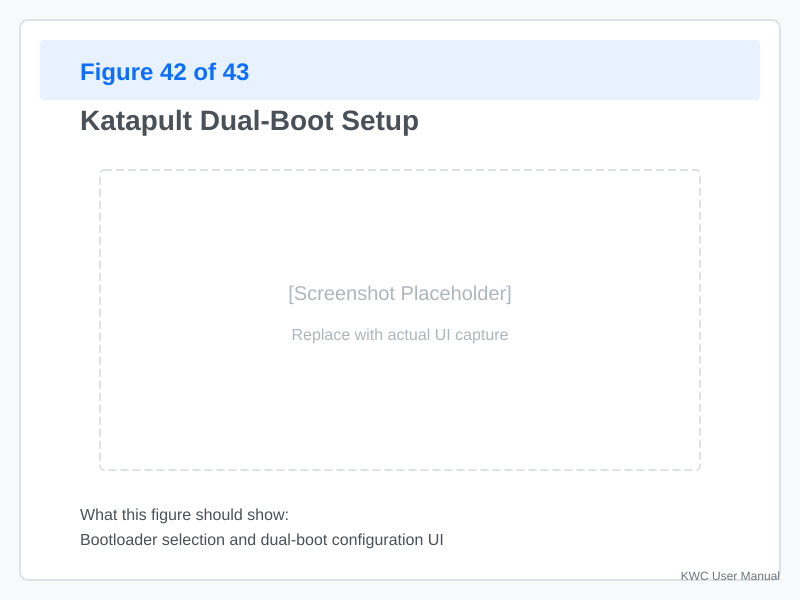
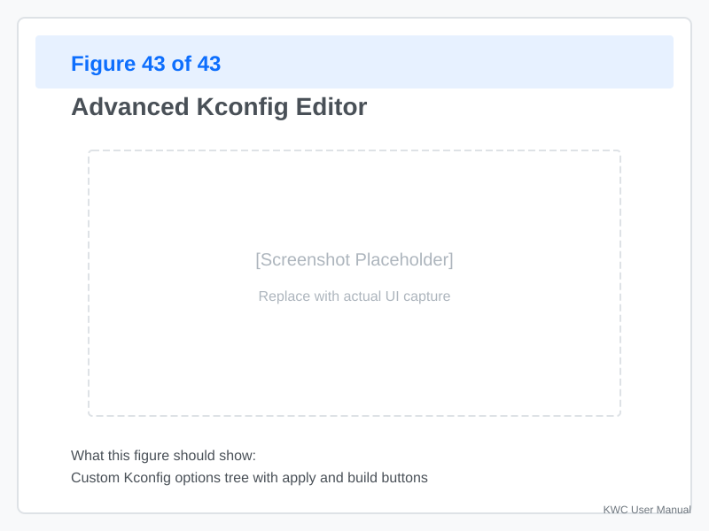

# Firmware Tooling

Advanced firmware configuration and flashing for experienced users. Covers Katapult integration, multi-board setups, and custom Kconfig options.

---

## Advanced Katapult Setup

### Dual-Boot Configurations

**Some boards support dual-boot** (Katapult + application firmware):



**Configuring dual-boot:**
1. **Flash Katapult** to the board
2. **Build Klipper** with Katapult bootloader option enabled
3. **Klipper can re-flash** itself via the Katapult interface

**Key Advantages:**

- **Remote Management:** Perform firmware updates without physical access to the printer.
- **OTA Support:** Enables seamless over-the-air updates when integrated with Moonraker.
- **Uniformity:** Provides a consistent flashing interface regardless of the underlying hardware.

### CAN Boot Flashing

**For CAN-connected boards:**

1. **Ensure CAN interface is active:**
   ```bash
   sudo ip link set can0 up type can bitrate 500000
   ```
2. **Bootloader must support CAN flash**
3. **KWC detects** CAN boot devices automatically

**KWC CAN flash workflow:**
1. **Build** firmware with CAN boot enabled
2. **Select** CAN device from list
3. **Flash** — KWC uploads via CAN bus

---

## Multi-Board Configurations

### Multiple Mainboards

**Some printers have multiple boards:**
- **Mainboard** — SBC communication
- **Toolhead board** — CAN or UART connection
- **Expansion board** — Additional GPIO

**KWC handles multi-board:**
1. **Flash each board separately** — Select target from list
2. **Kconfig per board** — Each board has its own configuration
3. **Unified view** — KWC shows all boards in one interface

**Example workflow:**
**Example Workflow:**
1. **Flash Spider (Mainboard)**
   - Select "Fysetc Spider"
   - Build and flash via USB
2. **Flash Toolhead CAN**
   - Select "RP2040 CAN"
   - Build and flash via CAN bus
3. **Verification**
   - Check Klipper status in KWC
   - Confirm CAN UUIDs match in the configuration

### Board Profiles

**Create profiles for each board:**

1. **Open Flash Tool**
2. **Configure first board** (e.g., Spider)
3. **Save profile** — "Spider-Klipper-DFU"
4. **Configure second board** (e.g., Toolhead)
5. **Save profile** — "Toolhead-Katapult-CAN"

**Use profiles for:**
- **Quick re-flashing** — One click per board
- **Consistency** — Same settings every time
- **Documentation** — Profile names describe the setup

---

## Kconfig Advanced Options

### Custom Features

**Enable/disable advanced features:**

| Feature | Kconfig Option | Description |
|---------|----------------|-------------|
| BLTouch | `BLTOUCH` | Support for BLTouch probe |
| Eddy Probe | `EDDY` | Support for Eddy probe |
| LCD Display | `REPRAP_DISPLAY` | Enable LCD support |
| Octoprint | `OCTOPRINT` | Octoprint integration |
| Extra G-Codes | `EXTRA_GCODE` | Additional G-code commands |

### Accessing Kconfig



**To edit Kconfig:**
1. **Open Flash Tool**
2. **Select target** (Klipper or Katapult)
3. **Click "Edit Kconfig"**
4. **Toggle options** — Check boxes to enable/disable
5. **Preview changes** — See what will be compiled

**Changes are saved** to your active profile and will be applied automatically during the next build.

### Custom Kconfig Files

**For advanced users:**

1. **Edit `Kconfig` directly** in the Klipper source
2. **Add custom options**
3. **Rebuild** — Your options appear in KWC

**Example custom option:**
```kconfig
config MY_CUSTOM_FEATURE
    bool "Enable my custom feature"
    default n
    help
        This enables my custom feature for...
```

---

## Firmware Updates

### Version Tracking

**KWC tracks** your firmware version:
- **Current commit** — Git SHA of Klipper source
- **Build timestamp** — When firmware was compiled
- **Features enabled** — List of Kconfig options

**Check version:**
1. **Open Flash Tool**
2. **Select target**
3. **View "Current Firmware"** section

### Updating Klipper Source

**To update to the latest Klipper:**

```bash
# SSH into your Pi
cd ~/klipper
git pull
sudo systemctl restart klipper
```

**In KWC:**
1. **Open Flash Tool**
2. **Click "Refresh Source"**
3. **Rebuild** with new source

**Warning:** Updating Klipper may break compatibility with custom configurations. Test on a spare board first.

### Rolling Back

**If a new version breaks something:**

**Warning:** Ensure your current working directory is clean (no uncommitted changes) before checking out a different commit.

1. **Find the previous commit:**
   ```bash
   cd ~/klipper
   git log --oneline
   ```
2. **Checkout previous commit:**
   ```bash
   git checkout <previous-sha>
   ```
3. **Rebuild** in KWC
4. **Flash** to your boards

---

## Custom Builds

### Forked Klipper

**Some users fork Klipper** for custom features:

1. **Clone your fork:**
   ```bash
   cd ~
   git clone https://github.com/youruser/klipper.git
   ```
2. **Configure KWC:**
   - **Update Source Path:** Edit the KWC configuration to point to your local fork's directory instead of the default Klipper path.
   - **Rebuild** — Use your fork's source
3. **Build and flash** as usual

### Patched Firmware

**Apply patches before building:**

```bash
# Apply patch
cd ~/klipper
git apply my-patch.patch

# Build in KWC
```

**Warning:** Patches may not persist across updates. Document your patches.

---

## Flash Verification

### Post-Flash Checks

**After flashing, verify:**

1. **Device responds:**
   ```bash
   ls -l /dev/ttyACM0  # Should exist
   ```
2. **Firmware version:**
   - Check Klipper status in KWC
   - Confirm version matches build
3. **All features work:**
   - Test axes movement
   - Verify probe
   - Check heaters

### Logging Flash Operations

**Keep a flash log:**

```bash
# In KWC, enable logging in settings
# Flash operations are logged to:
~/.config/klipper-wire-configurator/flash.log
```

**Log includes:**
- Timestamp
- Board type
- Firmware version
- Flash method
- Success/failure status

---

## Troubleshooting

### Build Slow or Fails

**Slow builds:**
- **Cause:** Pi is underpowered for large builds
- **Solution:** Use a PC for building, transfer firmware to Pi

**Build fails:**
- **Check dependencies:** `sudo apt install gcc make libncurses-dev bison`
- **Clean stale artifacts:** If switching Kconfig options causes errors, run `make clean` to clear the cache.
- **Retry build** in KWC

### Flash Intermittently Fails

**Possible causes:**
- **USB cable issues** — Try a different cable
- **Power supply** — Brownouts during flash
- **Board in wrong mode** — Manual reset required

**Solutions:**
1. **Use a powered USB hub**
2. **Hold BOOTSEL** (for RP2040) during flash
3. **Retry** — Sometimes a fluke

### Katapult Won't Accept Firmware

**Problem:** Board has Katapult but KWC can't flash via it.

**Check:**
1. **Katapult version** — Is it recent enough?
2. **Firmware format** — Some boards require `.bin`, others `.uf2`
3. **CAN configuration** — For CAN flash, ensure `can0` is up

**Manual flash via Katapult:**
```bash
# Using Python script
python3 ~/katapult/scripts/flashing.py /dev/ttyACM0 firmware.bin
```

---

## Appendix: Flash Script Examples

### DFU Flash (STM32)

```bash
dfu-util -d 0483:df11 -a 0 -s 0x08000000:le -D klipper.bin
```

### Serial Flash (AVR)

```bash
avrdude -c stk500v2 -p m2560 -P /dev/ttyUSB0 -b 115200 -U flash:w:klipper.bin
```

### RP2040 Mass Storage

```bash
# Copy file to mounted drive
cp klipper.uf2 /media/pi/RPI-RP2/
```

### CAN Boot Flash

```bash
python3 ~/klipper/scripts/canboot_flash.py -i can0 firmware.bin
```

---

*Next: [Appendix](./10-appendix.md)*
| Previous: [Native Mode](./08-native-mode.md)*
